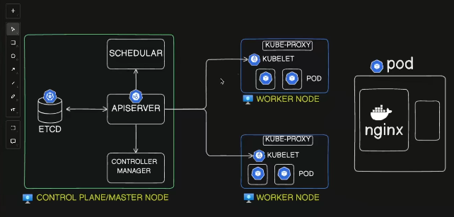

- Control plane or a master nodes are the virtual machines
- Worker nodes : Actual work running workloads in kubernetes
- Control plane or master node + other components  give the instructions to the worker node
- Pod : inside the worker node we have pod
  
why Pod :
    (we cant directly run the nginx in the worker node that's why we need pod )

    ( example : a babay in a room need he separate sa to protect (beduhh ))

    - Ideally ewe have one  container in the pod , but in sometime they may ore than 1 pod
    - Pod is the smallest deployable unit in kubernetes , other are replicaset etc
    - Pod helps to run the container in its own 
  ---

Worker nodes : work loads
Master node : componens ( API Server , Controller Manager ,Schedular  )

---

## Control Plane
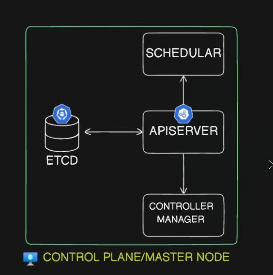

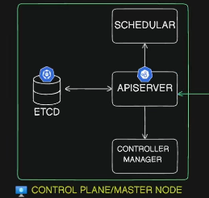

- ```API Server``` : Is the center of control plane & and any request  comes from te outside it firt reach the API Server ( main entry point of kubernetes cluster)

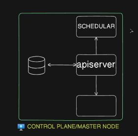

- ```Schedular``` : Schedule the Pod ( API Server send te request to teh Schedular ) and the schedular find the suitable node

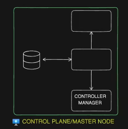

- ```Controller Manager```: Monitors Kubernetes object health; ensures containers that crash are recovered smoothly.  
- ```Kubernetes Controller Manager```: Core control plane component running control loops (controllers) to maintain desired state of the cluster.  

- **Key Functions**:  

  - **Running Built-in Controllers**:  
    - **Replication Controller**: Ensures specified number of Pod replicas are running.  
    - **Endpoints Controller**: Populates Endpoint objects for Services to route traffic to Pods.  
    - **Namespace Controller**: Manages lifecycle of Namespaces.  
    - **Node Controller**: Monitors Node health and manages taints.  
    - **Deployment Controller**: Manages Deployment lifecycle; ensures desired state during updates and rollbacks.  
    - **Job Controller**: Manages one-off tasks (Jobs) and ensures completion.  

  - **Maintaining Desired State**:  
    - Watches cluster’s actual state via the API Server.  
    - Detects discrepancies and takes corrective actions.  

  - **Lifecycle Management**:  
    - Garbage collects terminated Pods, events, and nodes.  
    - Handles cascading deletion of dependent resources.  

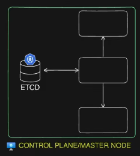

- ```ETDC``` : etcd is a consistent and highly-available key value store used as Kubernetes' backing store for all cluster data.

- If your Kubernetes cluster uses etcd as its backing store, make sure you have a back up plan for the data.

``` bash
when a request is commin into API SERVER , work done then instantly the data are stored in the ETDC & API Server only comminicate with the ETDC for data manipulation 
```
- DOC : [Kubernetes Doc](https://kubernetes.io/docs/tasks/administer-cluster/configure-upgrade-etcd/)


---

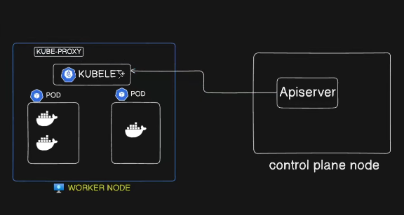

- If API Server send the request to the KUBELET to delete the pod the ```KUBELET``` go and make the changes  and the Kube proxy send te reponse to the API server and the API_SERVER update the data in ETDC
  
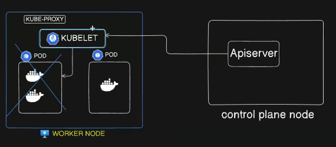

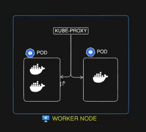

- ```kube-proxy``` : Helps in how pods are communicate each other , basically create some IP Table rules 

---

## END TO END FLOW 

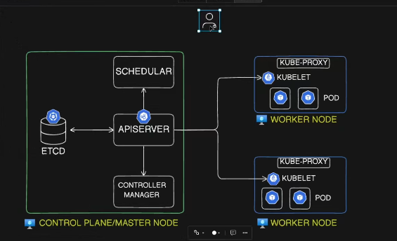

# Kubernetes Pod Creation Flow

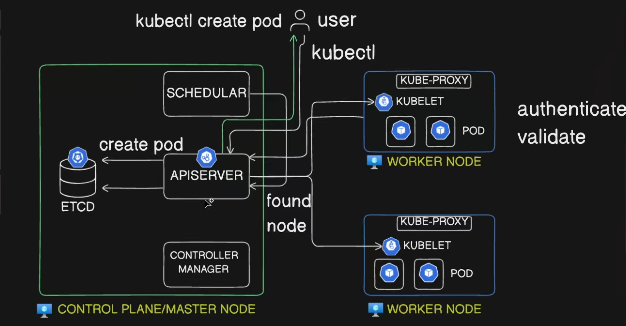
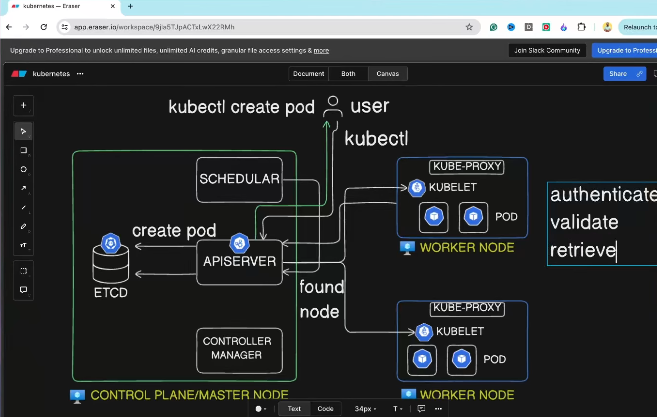
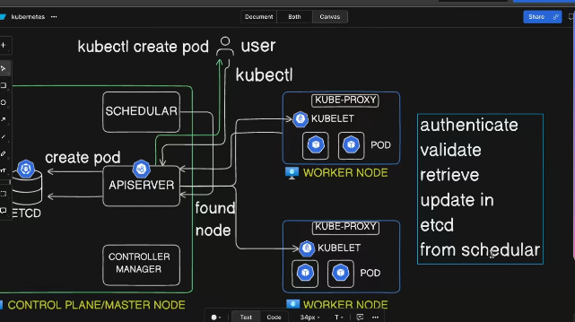
A simple note on how a Pod is created in Kubernetes using `kubectl`.

---
A step-by-step process of how a pod gets created:

### Step 1: User Request
```bash
kubectl create pod my-app
```
- User runs kubectl command
- Request sent to API Server

### Step 2: API Server Processing
- **Authentication**: Verifies user identity (IAM, tokens)
- **Validation**: Checks request format and permissions
- **Preparation**: Creates pod creation message

### Step 3: Save to ETCD
- API Server writes pod data to ETCD
- ETCD confirms successful write

### Step 4: Scheduling
- Scheduler watches ETCD for unscheduled pods
- Selects most suitable worker node
- Informs API Server of the decision

### Step 5: Pod Creation on Worker Node
- API Server sends instruction to kubelet on chosen node
- Kubelet creates the pod with specified containers

### Step 6: Confirmation
- Kubelet confirms pod creation
- Status updated: kubelet → API Server → ETCD
- User sees: "Pod created successfully"

``` bash
User → kubectl → API Server → ETCD → Scheduler → API Server → kube-proxy → kubelet → Pod
```
<br>

``` bash
now the send the request to get pods but this time the request dont get into the cluster just the API_ERVER read from the ETDC db ( which contains all data )