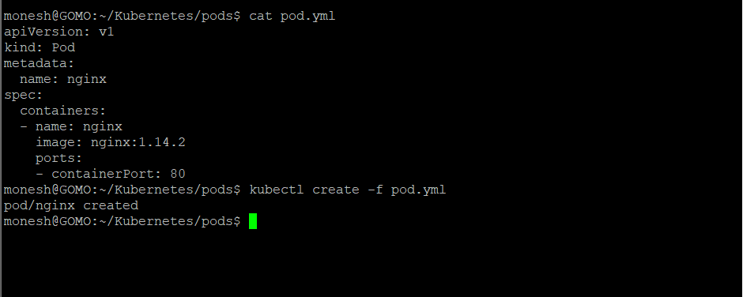
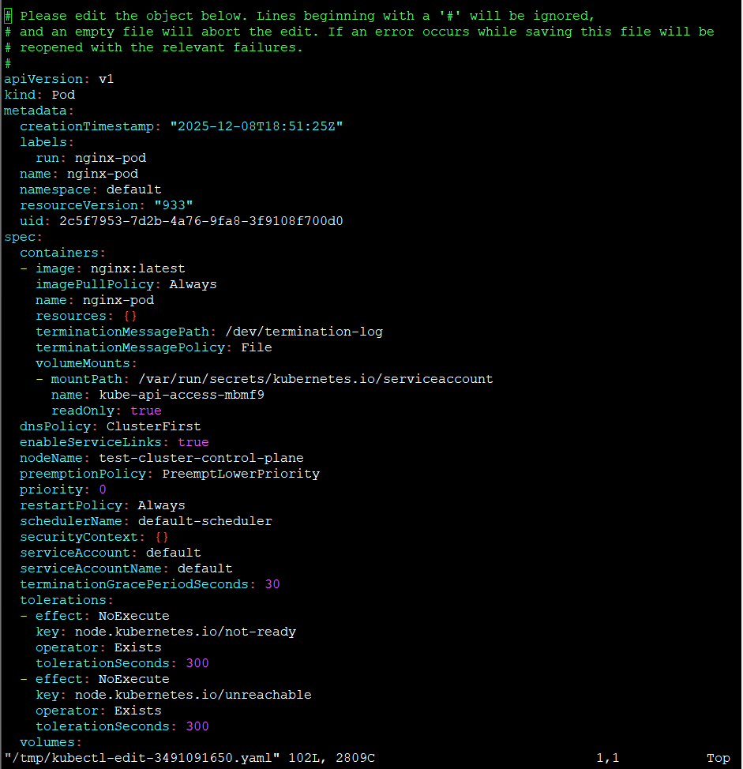

- create a nginx pod using imperative way


``` bash

    monesh@GOMO:~$ kubectl run nginx-pod --image=nginx:latest
    pod/nginx-pod created
    monesh@GOMO:~$ kubectl get pods
    NAME        READY   STATUS    RESTARTS   AGE
    nginx-pod   1/1     Running   0          66s
    monesh@GOMO:~$
```
Container creating -> running 
- Ready 1/1 => Pod have one container and that one container is running 


``` bash
monesh@GOMO:~/Kubernetes/pods$ cat pod.yml
apiVersion: v1
kind: Pod
metadata:
  name: nginx
spec:
  containers:
  - name: nginx
    image: nginx:1.14.2
    ports:
    - containerPort: 80
monesh@GOMO:~/Kubernetes/pods$ kubectl create -f pod.yml
pod/nginx created
monesh@GOMO:~/Kubernetes/pods$ kubectl get pods
NAME        READY   STATUS    RESTARTS   AGE
nginx       1/1     Running   0          104s
nginx-pod   1/1     Running   0          23m
monesh@GOMO:~/Kubernetes/pods$
```
## Troubleshooting

- List the what is  the error
``` bash
  kubectl decribe pod <NAME_OF_THE_POD>
```
``` bash
monesh@GOMO:~/Kubernetes/pods$ kubectl describe pod nginx-pod
Name:             nginx-pod
Namespace:        default
Priority:         0
Service Account:  default
Node:             test-cluster-control-plane/172.18.0.2
Start Time:       Tue, 09 Dec 2025 00:21:25 +0530
Labels:           run=nginx-pod
Annotations:      <none>
Status:           Running
IP:               10.244.0.5
IPs:
  IP:  10.244.0.5
Containers:
  nginx-pod:
    Container ID:   containerd://3d59b3a659c95579a188acf283fafe540d5993ed93cea18140f635b959badf73
    Image:          nginx:latest
    Image ID:       docker.io/library/nginx@sha256:553f64aecdc31b5bf944521731cd70e35da4faed96b2b7548a3d8e2598c52a42
    Port:           <none>
    Host Port:      <none>
    State:          Running
      Started:      Tue, 09 Dec 2025 00:22:00 +0530
    Ready:          True
    Restart Count:  0
    Environment:    <none>
    Mounts:
      /var/run/secrets/kubernetes.io/serviceaccount from kube-api-access-mbmf9 (ro)
Conditions:
  Type              Status
  Initialized       True
  Ready             True
  ContainersReady   True
  PodScheduled      True
Volumes:
  kube-api-access-mbmf9:
    Type:                    Projected (a volume that contains injected data from multiple sources)
    TokenExpirationSeconds:  3607
    ConfigMapName:           kube-root-ca.crt
    Optional:                false
    DownwardAPI:             true
QoS Class:                   BestEffort
Node-Selectors:              <none>
Tolerations:                 node.kubernetes.io/not-ready:NoExecute op=Exists for 300s
                             node.kubernetes.io/unreachable:NoExecute op=Exists for 300s
Events:
  Type    Reason     Age   From               Message
  ----    ------     ----  ----               -------
  Normal  Scheduled  28m   default-scheduler  Successfully assigned default/nginx-pod to test-cluster-control-plane
  Normal  Pulling    28m   kubelet            Pulling image "nginx:latest"
  Normal  Pulled     28m   kubelet            Successfully pulled image "nginx:latest" in 33.850203648s (33.850538451s including waiting)
  Normal  Created    28m   kubelet            Created container nginx-pod
  Normal  Started    28m   kubelet            Started container nginx-pod
monesh@GOMO:~/Kubernetes/pods$
```

- To edit the config inside the cluster 



``` text
   kubectl edit pod nginx-pod
```

---

- monesh@GOMO:~/Kubernetes/pods$ kubectl exec -it nginx-pod -- sh

---

## Dry Run

```text

monesh@GOMO:~/Kubernetes/pods$ kubectl run nginx --image=nginx --dry-run=client
pod/nginx created (dry run)
monesh@GOMO:~/Kubernetes/pods$

```

## Shortcut to create a simple ```yaml```
( replace yaml into json for json)
``` yml
monesh@GOMO:~/Kubernetes/pods$ kubectl run nginx --image=nginx --dry-run=client -o yaml
apiVersion: v1
kind: Pod
metadata:
  labels:
    run: nginx
  name: nginx
spec:
  containers:
  - image: nginx
    name: nginx
    resources: {}
  dnsPolicy: ClusterFirst
  restartPolicy: Always
status: {}

```

---

## Extend info for ```get pods ```

``` text
kubectl get pods -o wide
```

``` text
monesh@GOMO:~/Kubernetes/pods$ kubectl get pods -o wide
NAME        READY   STATUS    RESTARTS   AGE   IP           NODE                         NOMINATED NODE   READINESS GATES
nginx       1/1     Running   0          19m   10.244.0.7   test-cluster-control-plane   <none>           <none>
nginx-pod   1/1     Running   0          41m   10.244.0.5   test-cluster-control-plane   <none>           <none>
monesh@GOMO:~/Kubernetes/pods$
```