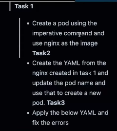
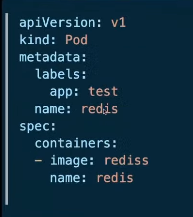
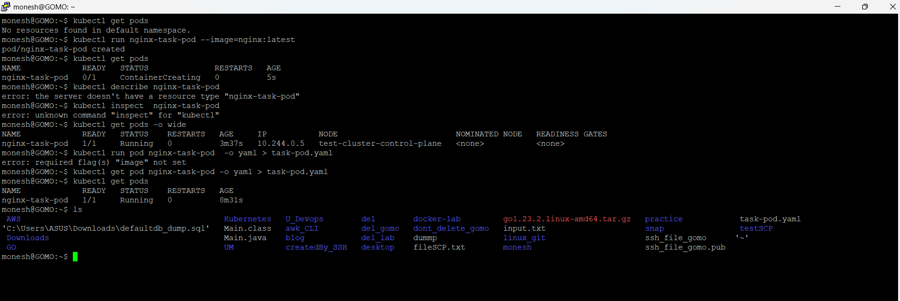
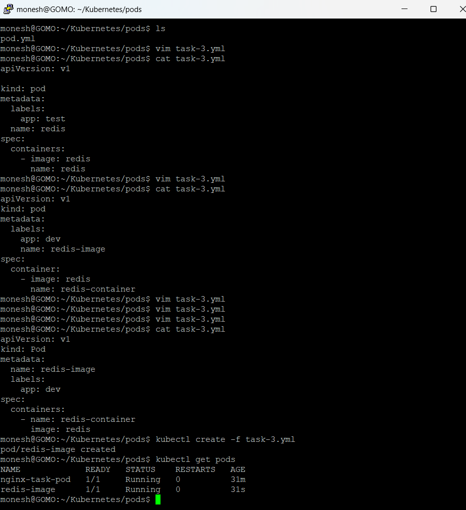

---

## Task 1 & 2



``` text
monesh@GOMO:~$ kubectl get pods
No resources found in default namespace.
monesh@GOMO:~$ kubectl run nginx-task-pod --image=nginx:latest
pod/nginx-task-pod created
monesh@GOMO:~$ kubectl get pods
NAME             READY   STATUS              RESTARTS   AGE
nginx-task-pod   0/1     ContainerCreating   0          5s
monesh@GOMO:~$ kubectl describe nginx-task-pod
error: the server doesn't have a resource type "nginx-task-pod"
monesh@GOMO:~$ kubectl inspect  nginx-task-pod
error: unknown command "inspect" for "kubectl"
monesh@GOMO:~$ kubectl get pods -o wide
NAME             READY   STATUS    RESTARTS   AGE     IP           NODE                         NOMINATED NODE   READINESS GATES
nginx-task-pod   1/1     Running   0          3m37s   10.244.0.5   test-cluster-control-plane   <none>           <none>
monesh@GOMO:~$ kubectl run pod nginx-task-pod  -o yaml > task-pod.yaml
error: required flag(s) "image" not set
monesh@GOMO:~$ kubectl get pod nginx-task-pod -o yaml > task-pod.yaml
monesh@GOMO:~$ kubectl get pods
NAME             READY   STATUS    RESTARTS   AGE
nginx-task-pod   1/1     Running   0          8m31s
monesh@GOMO:~$ ls
 AWS                                           Kubernetes   U_Devops        del        docker-lab         go1.23.2.linux-amd64.tar.gz   practice            task-pod.yaml
'C:\Users\ASUS\Downloads\defaultdb_dump.sql'   Main.class   awk_CLI         del_gomo   dont_delete_gomo   input.txt                     snap                testSCP
 Downloads                                     Main.java    blog            del_lab    dummp              linux_git                     ssh_file_gomo      '~'
 GO                                            UM           createdBy_SSH   desktop    fileSCP.txt        monesh                        ssh_file_gomo.pub
monesh@GOMO:~$
```

## Task 3 

``` text
monesh@GOMO:~/Kubernetes/pods$ cat task-3.yml
apiVersion: v1
kind: Pod
metadata:
  name: redis-image
  labels:
    app: dev
spec:
  containers:
    - name: redis-container
      image: redis
monesh@GOMO:~/Kubernetes/pods$ kubectl create -f task-3.yml
pod/redis-image created
monesh@GOMO:~/Kubernetes/pods$
```

