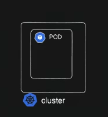
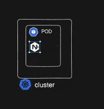
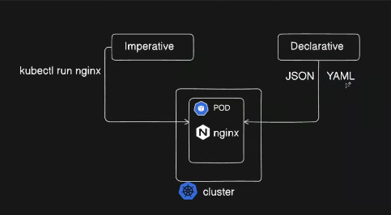

## Pods

 

- nginx running in pod

---
Two types we can run


- Imperative
``` bash
  kubectl run nginx
```
- Declarative
  - To run the pod in a declarative mode we need to define a config file in ```yml``` or in ```json```
  - Here we can set the desired state in the file ( we define everything )
