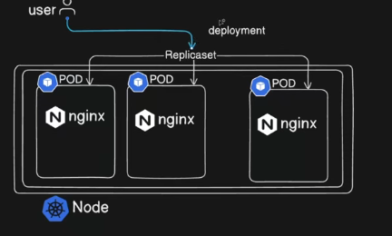
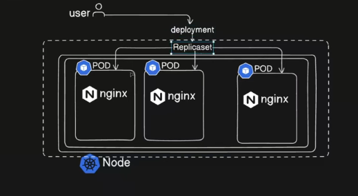
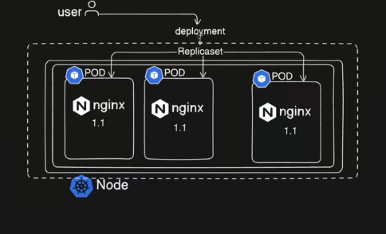
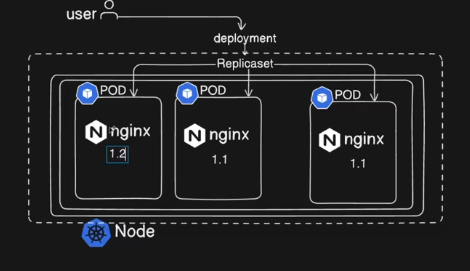
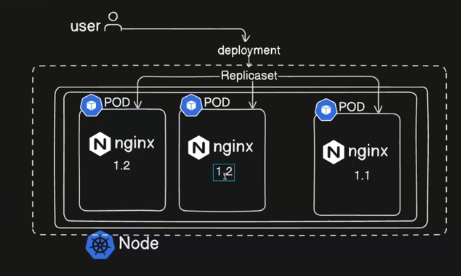
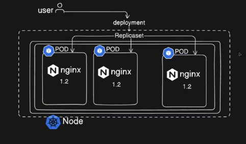

   
    

    - Provides Additional functionality to replicaset
    - We create a deployment and that  create the replicaSet

    ## ```Deployment manages -> ReplicaSet manages -> Pods ```

    

    ---
    

    Let be say the pods are running in 1.1 version and they are identical right ( same version , same template ) now we want to update from 1.1 to 1.2
    - If we just edit the replica file it just apply &  recreate the pods it leads to downtime for users  where using at the time
    - Light weight app no problem ( just 2 seconds ) , but a app like production ready ( bank,edu,stock) we dont want to make the users to get the downtime
    - We use the approach ```deployment``` at this time we use the ( rolling approach )
    - It used to update the pods and run a new pod one by one and the other pods server & manage the traffic

    

    

    

    Now all changes are made without any downtime

    ---
