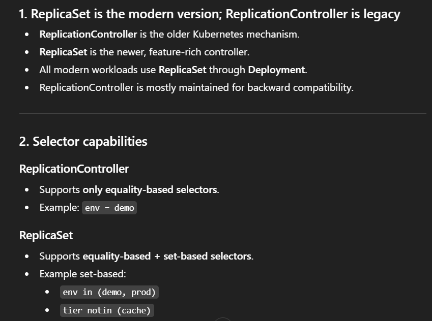
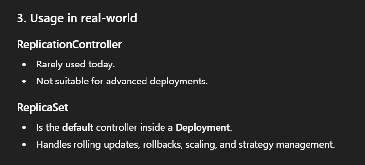
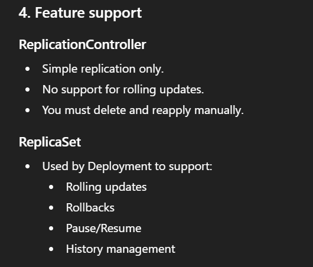
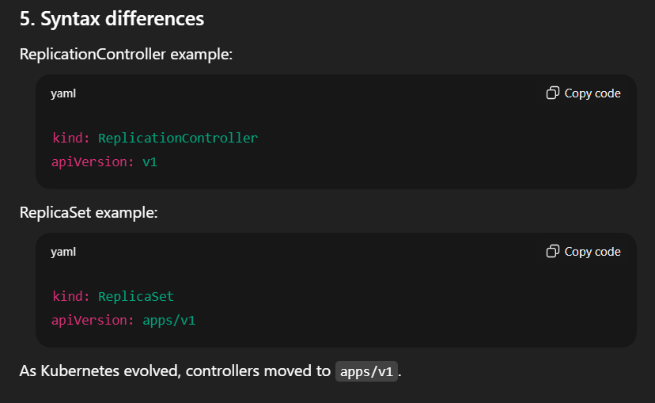

## ReplicationController

```text
kubectl explain rc
```

- rc : replication controller
---
```text
monesh@GOMO:~/Kubernetes$ kubectl explain rc
KIND:       ReplicationController
VERSION:    v1

DESCRIPTION:
    ReplicationController represents the configuration of a replication
    controller.

FIELDS:
  apiVersion    <string>
    APIVersion defines the versioned schema of this representation of an object.
    Servers should convert recognized schemas to the latest internal value, and
    may reject unrecognized values. More info:
    https://git.k8s.io/community/contributors/devel/sig-architecture/api-conventions.md#resources

  kind  <string>
    Kind is a string value representing the REST resource this object
    represents. Servers may infer this from the endpoint the client submits
    requests to. Cannot be updated. In CamelCase. More info:
    https://git.k8s.io/community/contributors/devel/sig-architecture/api-conventions.md#types-kinds

  metadata      <ObjectMeta>
    If the Labels of a ReplicationController are empty, they are defaulted to be
    the same as the Pod(s) that the replication controller manages. Standard
    object's metadata. More info:
    https://git.k8s.io/community/contributors/devel/sig-architecture/api-conventions.md#metadata

  spec  <ReplicationControllerSpec>
    Spec defines the specification of the desired behavior of the replication
    controller. More info:
    https://git.k8s.io/community/contributors/devel/sig-architecture/api-conventions.md#spec-and-status

  status        <ReplicationControllerStatus>
    Status is the most recently observed status of the replication controller.
    This data may be out of date by some window of time. Populated by the
    system. Read-only. More info:
    https://git.k8s.io/community/contributors/devel/sig-architecture/api-conventions.md#spec-and-status


monesh@GOMO:~/Kubernetes$

```
<br>

```text
monesh@GOMO:~/Kubernetes$ vim replicationController.yml
monesh@GOMO:~/Kubernetes$ kubectl get pods
No resources found in default namespace.
monesh@GOMO:~/Kubernetes$ kubectl apply -f replicationController.yml
replicationcontroller/nginx-rc created
monesh@GOMO:~/Kubernetes$ kubectl get pods
NAME             READY   STATUS              RESTARTS   AGE
nginx-rc-5mw4x   0/1     ContainerCreating   0          7s
nginx-rc-6v4q8   0/1     ContainerCreating   0          7s
nginx-rc-957wn   1/1     Running             0          7s
monesh@GOMO:~/Kubernetes$ vim replicationController.yml
monesh@GOMO:~/Kubernetes$ cat replicationController.yml
apiVersion: v1
kind: ReplicationController
metadata:
  name: nginx-rc
  labels:
    env: demo
spec:
  replicas: 3
  template:
    metadata:
      labels:
        env: demo
    spec:
      containers:
        - name: nginx
          image: nginx
monesh@GOMO:~/Kubernetes$ kubectl get rc
NAME       DESIRED   CURRENT   READY   AGE
nginx-rc   3         3         3       82s
monesh@GOMO:~/Kubernetes$ kubectl get pods
NAME             READY   STATUS    RESTARTS   AGE
nginx-rc-5mw4x   1/1     Running   0          112s
nginx-rc-6v4q8   1/1     Running   0          112s
nginx-rc-957wn   1/1     Running   0          112s
monesh@GOMO:~/Kubernetes$ kubectl describe nginx-rc-5mw4x
error: the server doesn't have a resource type "nginx-rc-5mw4x"
monesh@GOMO:~/Kubernetes$ kubectl describe pod nginx-rc-5mw4x
Name:             nginx-rc-5mw4x
Namespace:        default
Priority:         0
Service Account:  default
Node:             test-cluster-control-plane/172.18.0.2
Start Time:       Wed, 10 Dec 2025 23:11:42 +0530
Labels:           env=demo
Annotations:      <none>
Status:           Running
IP:               10.244.0.7
IPs:
  IP:           10.244.0.7
Controlled By:  ReplicationController/nginx-rc
Containers:
  nginx:
    Container ID:   containerd://425d02656c65fd4cf303952bfd00e9ec012ebdffd062dd3c83590f805fe2e636
    Image:          nginx
    Image ID:       docker.io/library/nginx@sha256:325b00a35073d9aa1d3df16da8afbbae1ac7d824c505f7490cd5cdbb79d60f6d
    Port:           <none>
    Host Port:      <none>
    State:          Running
      Started:      Wed, 10 Dec 2025 23:11:49 +0530
    Ready:          True
    Restart Count:  0
    Environment:    <none>
    Mounts:
      /var/run/secrets/kubernetes.io/serviceaccount from kube-api-access-p5tvp (ro)
Conditions:
  Type              Status
  Initialized       True
  Ready             True
  ContainersReady   True
  PodScheduled      True
Volumes:
  kube-api-access-p5tvp:
    Type:                    Projected (a volume that contains injected data from multiple sources)
    TokenExpirationSeconds:  3607
    ConfigMapName:           kube-root-ca.crt
    Optional:                false
    DownwardAPI:             true
QoS Class:                   BestEffort
Node-Selectors:              <none>
Tolerations:                 node.kubernetes.io/not-ready:NoExecute op=Exists for 300s
                             node.kubernetes.io/unreachable:NoExecute op=Exists for 300s
Events:
  Type    Reason     Age    From               Message
  ----    ------     ----   ----               -------
  Normal  Scheduled  2m23s  default-scheduler  Successfully assigned default/nginx-rc-5mw4x to test-cluster-control-plane
  Normal  Pulling    2m23s  kubelet            Pulling image "nginx"
  Normal  Pulled     2m18s  kubelet            Successfully pulled image "nginx" in 2.494780476s (5.121873698s including waiting)
  Normal  Created    2m17s  kubelet            Created container nginx
  Normal  Started    2m17s  kubelet            Started container nginx
monesh@GOMO:~/Kubernetes$

```





---

## ReplicaSet

```text
kubectl explain  rs
```

- rc is used to only manage the pod created in that replica controller
- rs we can manage the existing pod  and that are not part of this replicaSet by using the ```selector``` by matching teh label

``Example :``

```text
monesh@GOMO:~/Kubernetes$ ls
check-docker.sh  config.yml  pods  replicationController.yml  stop-docker.sh
monesh@GOMO:~/Kubernetes$ vim replicaSet.yaml
monesh@GOMO:~/Kubernetes$ cat replicationController.yml
apiVersion: v1
kind: ReplicationController
metadata:
  name: nginx-rc
  labels:
    env: demo
spec:
  replicas: 3
  template:
    metadata:
      labels:
        env: demo
    spec:
      containers:
        - name: nginx
          image: nginx
monesh@GOMO:~/Kubernetes$ cat replicaSet.yaml
apiVersion: v1
kind: ReplicaSet
metadata:
  name: nginx-rs
  labels:
    env: demo
spec:
  replicas: 3
  selector:
    matchLabels:
      env: demo
  template:
    metadata:
      labels:
        env: demo
    spec:
      containers:
        - name: nginx
          image: nginx
monesh@GOMO:~/Kubernetes$


```

## ```Point to note while writing the replicaSet ```

- we need to add the new field called: apps
```text

monesh@GOMO:~/Kubernetes$ kubectl explain rs
GROUP:      apps
KIND:       ReplicaSet
VERSION:    v1

DESCRIPTION:
    ReplicaSet ensures that a specified number of pod replicas are running at
    any given time.

FIELDS:
  apiVersion    <string>
    APIVersion defines the versioned schema of this representation of an object.
    Servers should convert recognized schemas to the latest internal value, and
    may reject unrecognized values. More info:
    https://git.k8s.io/community/contributors/devel/sig-architecture/api-conventions.md#resources

  kind  <string>
    Kind is a string value representing the REST resource this object
    represents. Servers may infer this from the endpoint the client submits
    requests to. Cannot be updated. In CamelCase. More info:
    https://git.k8s.io/community/contributors/devel/sig-architecture/api-conventions.md#types-kinds

  metadata      <ObjectMeta>
    If the Labels of a ReplicaSet are empty, they are defaulted to be the same
    as the Pod(s) that the ReplicaSet manages. Standard object's metadata. More
    info:
    https://git.k8s.io/community/contributors/devel/sig-architecture/api-conventions.md#metadata

  spec  <ReplicaSetSpec>
    Spec defines the specification of the desired behavior of the ReplicaSet.
    More info:
    https://git.k8s.io/community/contributors/devel/sig-architecture/api-conventions.md#spec-and-status

  status        <ReplicaSetStatus>
    Status is the most recently observed status of the ReplicaSet. This data may
    be out of date by some window of time. Populated by the system. Read-only.
    More info:
    https://git.k8s.io/community/contributors/devel/sig-architecture/api-conventions.md#spec-and-status


monesh@GOMO:~/Kubernetes$ vim replicaSet.yaml
monesh@GOMO:~/Kubernetes$ cat replicaSet.yaml
apiVersion: apps/v1
kind: ReplicaSet
metadata:
  name: nginx-rs
  labels:
    env: demo
spec:
  replicas: 3
  selector:
    matchLabels:
      env: demo
  template:
    metadata:
      labels:
        env: demo
    spec:
      containers:
        - name: nginx
          image: nginx
monesh@GOMO:~/Kubernetes$

```

```text
monesh@GOMO:~/Kubernetes$ kubectl apply -f replicaSet.yaml
replicaset.apps/nginx-rs created
monesh@GOMO:~/Kubernetes$ kubectl get pods
NAME             READY   STATUS    RESTARTS   AGE
nginx-rc-5mw4x   1/1     Running   0          19m
nginx-rc-6v4q8   1/1     Running   0          19m
nginx-rc-957wn   1/1     Running   0          19m
nginx-rs-dsxkv   1/1     Running   0          13s
nginx-rs-npcf9   1/1     Running   0          13s
nginx-rs-sqxb9   1/1     Running   0          13s
monesh@GOMO:~/Kubernetes$ kubectl delete rc/nginx
Error from server (NotFound): replicationcontrollers "nginx" not found
monesh@GOMO:~/Kubernetes$ kubectl delete rc/nginx-rc
replicationcontroller "nginx-rc" deleted from default namespace
monesh@GOMO:~/Kubernetes$ kubectl get pods
NAME             READY   STATUS    RESTARTS   AGE
nginx-rs-dsxkv   1/1     Running   0          47s
nginx-rs-npcf9   1/1     Running   0          47s
nginx-rs-sqxb9   1/1     Running   0          47s
monesh@GOMO:~/Kubernetes$


```

## ```We can update the rs.yaml in different ways```
- Just update the rs.yml and apply 
- Or ``Update the live object by using cmd ``
    ``` text
    kubectl edit rs/nginx-rs
  ```
- Here he live difference 
```text
monesh@GOMO:~/Kubernetes$ kubectl get pods
NAME             READY   STATUS    RESTARTS   AGE
nginx-rs-dsxkv   1/1     Running   0          110s
nginx-rs-npcf9   1/1     Running   0          110s
nginx-rs-sqxb9   1/1     Running   0          110s
monesh@GOMO:~/Kubernetes$ kubectl edit rs/nginx-rs
replicaset.apps/nginx-rs edited
monesh@GOMO:~/Kubernetes$ kubectl get pods
NAME             READY   STATUS    RESTARTS   AGE
nginx-rs-dsxkv   1/1     Running   0          5m56s
nginx-rs-npcf9   1/1     Running   0          5m56s
nginx-rs-sqxb9   1/1     Running   0          5m56s
nginx-rs-x2cbt   1/1     Running   0          5s
monesh@GOMO:~/Kubernetes$
```
- Using kubectl imperative way

```text
kubectl scale --replicas=10 rs/nginx-rs
```

```text
monesh@GOMO:~/Kubernetes$ kubectl get pods
NAME             READY   STATUS    RESTARTS   AGE
nginx-rs-dsxkv   1/1     Running   0          110s
nginx-rs-npcf9   1/1     Running   0          110s
nginx-rs-sqxb9   1/1     Running   0          110s
monesh@GOMO:~/Kubernetes$ kubectl edit rs/nginx-rs
replicaset.apps/nginx-rs edited
monesh@GOMO:~/Kubernetes$ kubectl get pods
NAME             READY   STATUS    RESTARTS   AGE
nginx-rs-dsxkv   1/1     Running   0          5m56s
nginx-rs-npcf9   1/1     Running   0          5m56s
nginx-rs-sqxb9   1/1     Running   0          5m56s
nginx-rs-x2cbt   1/1     Running   0          5s
monesh@GOMO:~/Kubernetes$ kubectl scale --replicas=10 rs/nginx-rs
replicaset.apps/nginx-rs scaled
monesh@GOMO:~/Kubernetes$ kubectl get pods
NAME             READY   STATUS              RESTARTS   AGE
nginx-rs-5sgqj   0/1     ContainerCreating   0          5s
nginx-rs-dsxkv   1/1     Running             0          7m56s
nginx-rs-n59f2   0/1     ContainerCreating   0          5s
nginx-rs-npcf9   1/1     Running             0          7m56s
nginx-rs-s4szs   0/1     ContainerCreating   0          5s
nginx-rs-sqxb9   1/1     Running             0          7m56s
nginx-rs-v7hgg   0/1     ContainerCreating   0          5s
nginx-rs-wxkhs   0/1     ContainerCreating   0          5s
nginx-rs-x2cbt   1/1     Running             0          2m5s
nginx-rs-xm9qx   0/1     ContainerCreating   0          5s
monesh@GOMO:~/Kubernetes$

```
