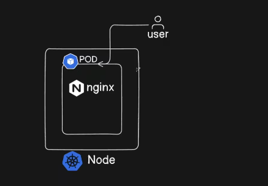
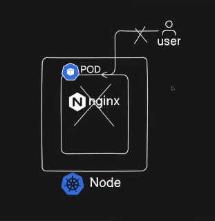
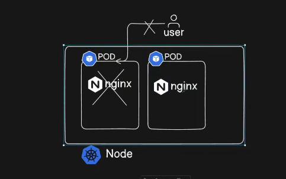
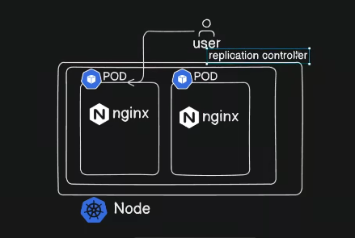
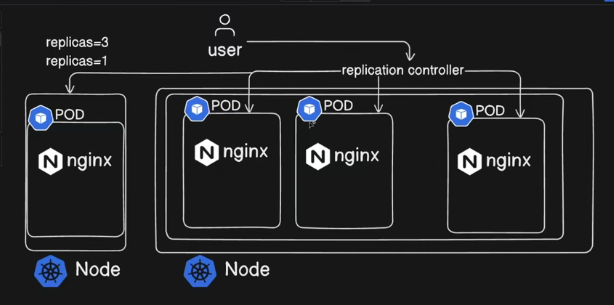

- Let be say the user made a request to this pod , after sometime unfortunately the container crash 
- Which makes the unable to send the response



- This is the drawback of running docker container in a standalone environment 
- There should be a mechanism it need to auto-heal the  app or create the new pod here the ```replication controller``` done the something



- But most of the time the new pod spinUp for ```high traffic``` 

# And this is part of another ```Kubernetes Object```
- Application Controller




- Controller are managed by ```Controller Manager``` one of teh kubernetes component
  - Types of controller are :
    - Pod
    - Node
    - Namespace

- It ensures application not crash if any pod failure these are the set of replication controller
- By mentioning in  the ```replica=3``` in  pod.yaml
## ```Replication Controller is responsible for creating a new pods when the pod meet high traffic or container crash```

- It ensure application always in highly available all the time 
- How ?, now we are redirecting the request to multiple pods
- Replication Controller is responsible to redirect the traffic to the health and low load pod

---

## Point to note in replicas



- If we set more no. of replicas in the node ( EC2 ) it use more resources from the node only like ( CPU,MEMORY, STORAGE )
- When the Pod is running OUT OF CAPACITY
  - At that time we create a new kubernetes node and provision the pod in the new node by using the ```replication controller``` 
  - Initially we redirect the traffic to different pod , but now we redirect with different nodes
