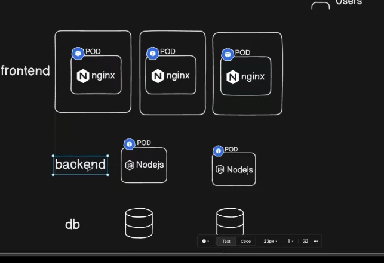
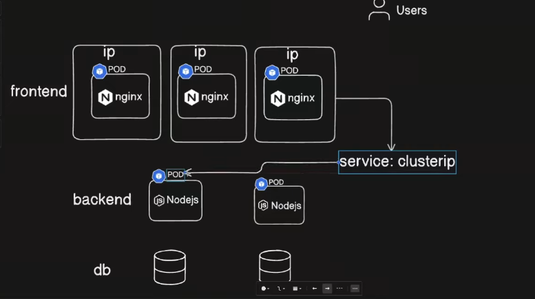

---
If the frontend wants to communicate with backend and backend wants to communicate with db ) 
they need the domain IP but on problem is )
---
-  When the pod restart or ( when a new pod is created by  replica )
- At this time the pod IP is different ehy because the pods ip are assigned dynamically
---

## This is where ```Cluster IP``` comes into picture 

---

- we used to create a service as clusterService
  - ```service: ClusterIp```
  - 


- Here trhe service:Cluster_IP have the ``END_POINTS`` of the two backend ( pods )

``` bash
monesh@GOMO:~$ k8 get svc
NAME           TYPE        CLUSTER-IP      EXTERNAL-IP   PORT(S)        AGE
kubernetes     ClusterIP   10.96.0.1       <none>        443/TCP        26m
nodeport-svc   NodePort    10.96.169.211   <none>        80:30001/TCP   25m
monesh@GOMO:~$
```
---

### Now let us create a new cluster_IP service ( see in Implementation_Cluster_IP/Terminal.md)
