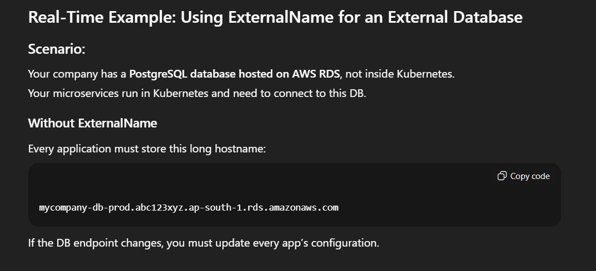
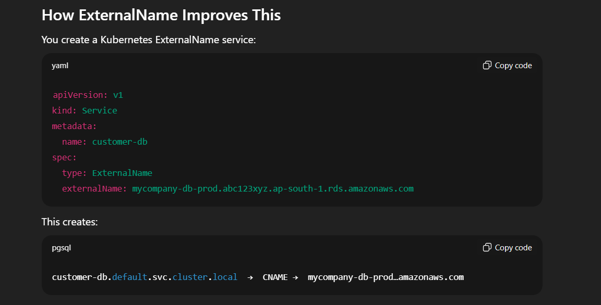
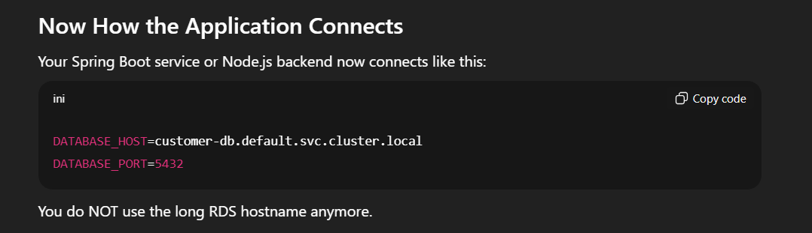
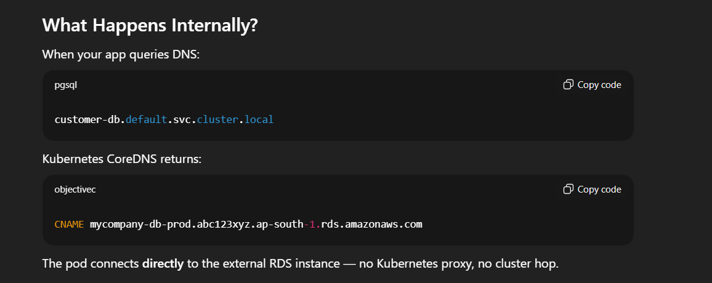
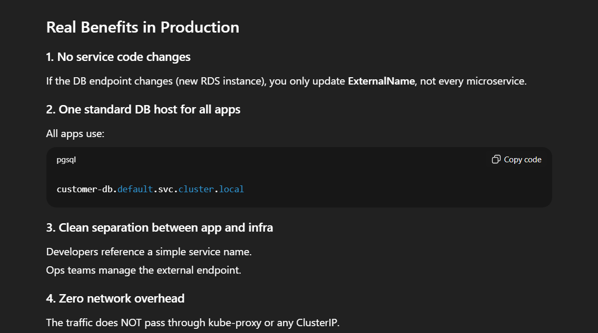
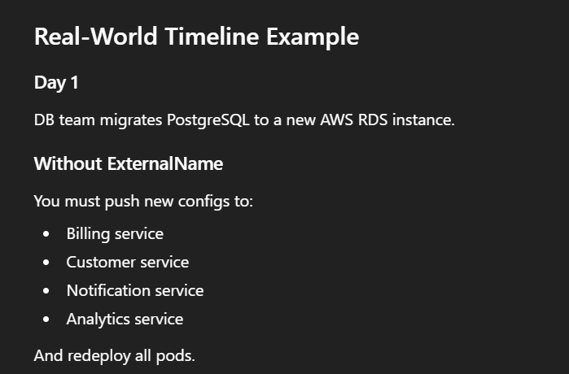
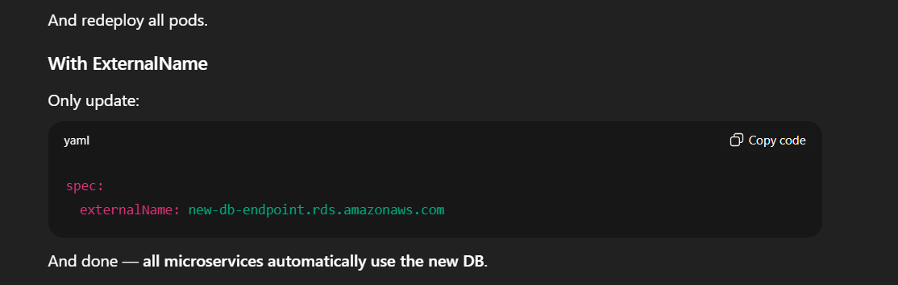

- URL : [DOC](https://kubernetes.io/docs/concepts/services-networking/service/#externalname)

ExternalName Service – Explained

An ExternalName Service is a special Kubernetes Service type (spec.type: ExternalName) that maps a Service in your cluster to an external DNS name, without creating any proxy or load balancer.

Instead of forwarding traffic, Kubernetes simply returns a CNAME record redirecting the request to the external service.

Key Characteristics

| Feature          | Description                                                                    |
| ---------------- | ------------------------------------------------------------------------------ |
| **Service Type** | `ExternalName`                                                                 |
| **Purpose**      | Provide a DNS alias inside the cluster for an external service                 |
| **No ClusterIP** | It does not allocate a ClusterIP                                               |
| **No Proxying**  | kube-proxy does not handle traffic                                             |
| **DNS Only**     | A DNS CNAME record is created pointing to the external target                  |
| **Use Case**     | Access external databases, APIs, or legacy systems via a standard service name |

``` yaml
apiVersion: v1
kind: Service
metadata:
  name: my-external-service
spec:
  type: ExternalName
  externalName: api.example.com
```

How It Works

Inside your cluster, when a pod resolves:
``` bash
my-external-service.default.svc.cluster.local
```
Kubernetes DNS returns a CNAME → api.example.com

The pod then connects directly to api.example.com

When to Use ExternalName

Use this when you want:

A consistent DNS name inside the cluster

To refer to an external resource (e.g., AWS RDS DB, SaaS API)

No need for load balancing or port mapping

A lightweight service without proxies or network hops

When NOT to Use ExternalName

Avoid it when:

You need port forwarding (use ClusterIP/NodePort/LoadBalancer instead)

You want health checks

You expect Kubernetes to manage traffic

The external service does not support proper DNS resolution


---













