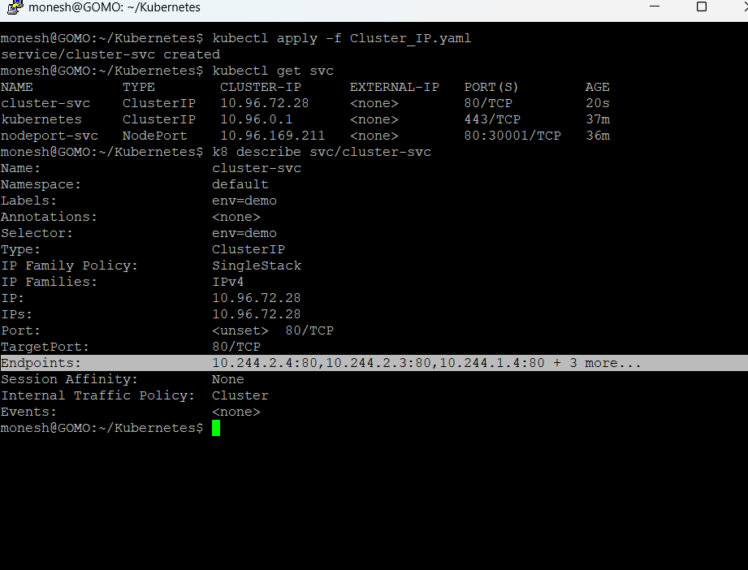

``` bash
monesh@GOMO:~$ k8 get svc
NAME           TYPE        CLUSTER-IP      EXTERNAL-IP   PORT(S)        AGE
kubernetes     ClusterIP   10.96.0.1       <none>        443/TCP        26m
nodeport-svc   NodePort    10.96.169.211   <none>        80:30001/TCP   25m
monesh@GOMO:~$ cd Kubernetes
monesh@GOMO:~/Kubernetes$ cat nodePort.yaml
apiVersion: v1
kind: Service
metadata:
  name: nodeport-svc
  labels:
    env: demo
spec:
  type: NodePort
  selector:
    env: demo
  ports:
    - port: 80
      targetPort: 80
      nodePort: 30001

monesh@GOMO:~/Kubernetes$ kubeclt explain svc

Command 'kubeclt' not found, did you mean:

  command 'kubectl' from snap kubectl (1.34.2)

See 'snap info <snapname>' for additional versions.

monesh@GOMO:~/Kubernetes$ k8 explain svc
KIND:       Service
VERSION:    v1

DESCRIPTION:
    Service is a named abstraction of software service (for example, mysql)
    consisting of local port (for example 3306) that the proxy listens on, and
    the selector that determines which pods will answer requests sent through
    the proxy.

FIELDS:
  apiVersion    <string>
    APIVersion defines the versioned schema of this representation of an object.
    Servers should convert recognized schemas to the latest internal value, and
    may reject unrecognized values. More info:
    https://git.k8s.io/community/contributors/devel/sig-architecture/api-conventions.md#resources

  kind  <string>
    Kind is a string value representing the REST resource this object
    represents. Servers may infer this from the endpoint the client submits
    requests to. Cannot be updated. In CamelCase. More info:
    https://git.k8s.io/community/contributors/devel/sig-architecture/api-conventions.md#types-kinds

  metadata      <ObjectMeta>
    Standard object's metadata. More info:
    https://git.k8s.io/community/contributors/devel/sig-architecture/api-conventions.md#metadata

  spec  <ServiceSpec>
    Spec defines the behavior of a service.
    https://git.k8s.io/community/contributors/devel/sig-architecture/api-conventions.md#spec-and-status

  status        <ServiceStatus>
    Most recently observed status of the service. Populated by the system.
    Read-only. More info:
    https://git.k8s.io/community/contributors/devel/sig-architecture/api-conventions.md#spec-and-status


monesh@GOMO:~/Kubernetes$ vim Cluster_IP.yaml
monesh@GOMO:~/Kubernetes$ cat Cluster_IP.yaml
apiVersion: v1
kind: Service
metadata:
  name: cluster-svc
  labels:
    env: demo
spec:
  type: ClusterIP  # the default service name is also cluster ip not mandatory to mention but good practice
  selector:
    env: demo   # teh cluster IP get the deployment where exposed with env: demo label
  ports:
    - port: 80
      targetPort: 80
monesh@GOMO:~/Kubernetes$ vim Cluster_IP.yaml
monesh@GOMO:~/Kubernetes$ cat Cluster_IP.yaml
apiVersion: v1
kind: Service
metadata:
  name: cluster-svc
  labels:
    env: demo
spec:
  type: ClusterIP  # the default service name is also cluster ip not mandatory to mention but good practice
  selector:
    env: demo   # the  cluster IP get the deployment where exposed with env: demo label
  ports:
    - port: 80
      targetPort: 80
monesh@GOMO:~/Kubernetes$ kubectl apply -f Cluster_IP.yaml
service/cluster-svc created
monesh@GOMO:~/Kubernetes$ kubectl get svc
NAME           TYPE        CLUSTER-IP      EXTERNAL-IP   PORT(S)        AGE
cluster-svc    ClusterIP   10.96.72.28     <none>        80/TCP         20s
kubernetes     ClusterIP   10.96.0.1       <none>        443/TCP        37m
nodeport-svc   NodePort    10.96.169.211   <none>        80:30001/TCP   36m
monesh@GOMO:~/Kubernetes$
```


- Endpoints : IP's of the pod where the clusterIP Service is listening to 

``` text

monesh@GOMO:~/Kubernetes$ kubectl get pods -o wide
NAME                            READY   STATUS    RESTARTS   AGE   IP           NODE                  NOMINATED NODE   READINESS GATES
nginx-deploy-84568f8674-gd5p2   1/1     Running   0          38m   10.244.2.4   cka-cluster-worker    <none>           <none>
nginx-deploy-84568f8674-hcmd7   1/1     Running   0          38m   10.244.2.3   cka-cluster-worker    <none>           <none>
nginx-deploy-84568f8674-r8gj8   1/1     Running   0          38m   10.244.1.4   cka-cluster-worker2   <none>           <none>
nginx-rc-2b5ng                  1/1     Running   0          39m   10.244.1.2   cka-cluster-worker2   <none>           <none>
nginx-rc-b2ltq                  1/1     Running   0          39m   10.244.1.3   cka-cluster-worker2   <none>           <none>
nginx-rc-c49cm                  1/1     Running   0          39m   10.244.2.2   cka-cluster-worker    <none>           <none>
monesh@GOMO:~/Kubernetes$


```

## Also we can run this also

``` bash
  kubectl  get ep 
```

- Where ep: END_POINTS
  
``` bash
  monesh@GOMO:~/Kubernetes$ k8 get ep
  NAME           ENDPOINTS                                               AGE
  cluster-svc    10.244.1.2:80,10.244.1.3:80,10.244.1.4:80 + 3 more...   6m54s
  kubernetes     172.18.0.4:6443                                         44m
  nodeport-svc   10.244.1.2:80,10.244.1.3:80,10.244.1.4:80 + 3 more...   42m
  monesh@GOMO:~/Kubernetes$
```