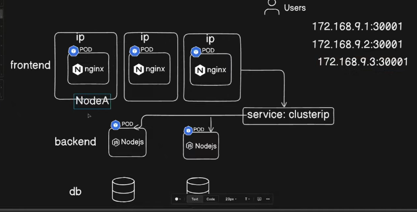
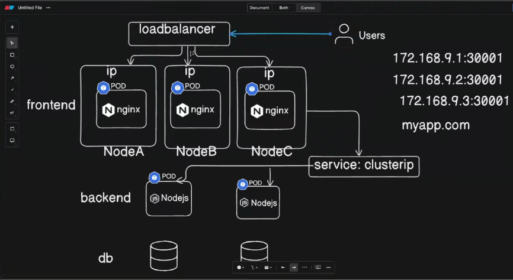

- Think in case we have 50 ndoes are running and we cant able to give 50 IP Address to the users to access 
- We jsut need to give a single URL or Domain like ( myapp.com )
##  To fix this issue we sue te ```loadbalancer```



- How to setUp a ```LoadBalancer``` in kubernetes 
  - We use to create a external  LoadBalancer  in the CLOUD ( AWS , GCP) and we provision the external LB and we can sue the service type loadbalncer in k8 and it refer that loadbalancer 
  
---

## ```LoadBalancer.yml```

``` yaml
apiVersion: v1
kind: Service
metadata:
  name: lb-svc
  labels:
    env: demo
spec:
  type: LoadBalancer
  selector:
    env: demo       # matches pods with label env=demo
  ports:
    - port: 80      # Service port
```