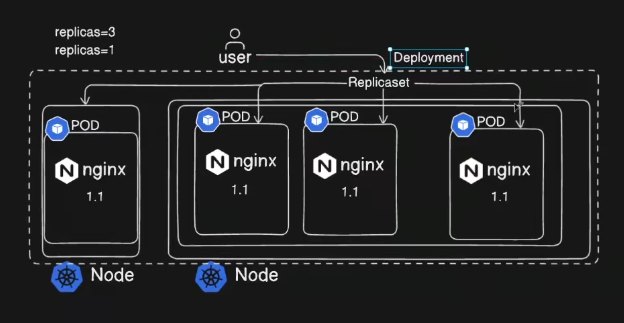
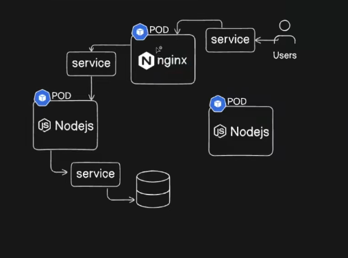
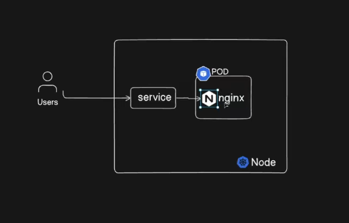
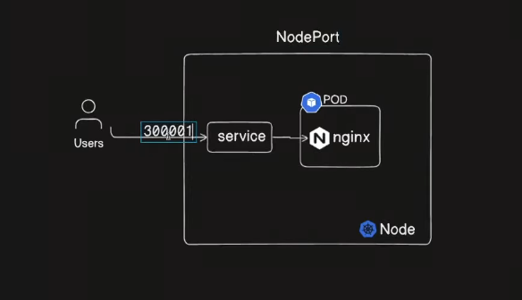
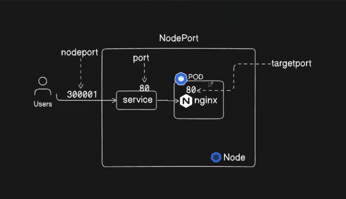
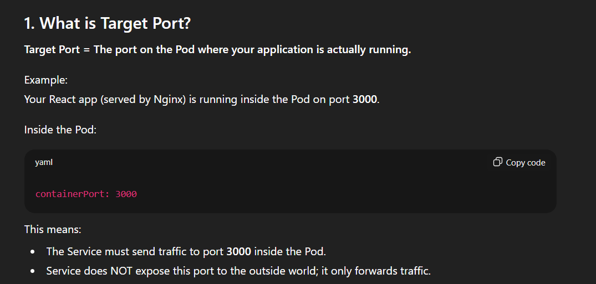
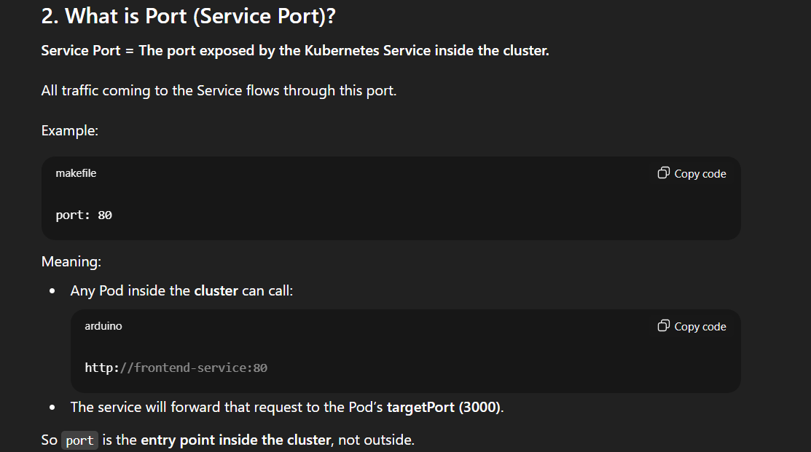
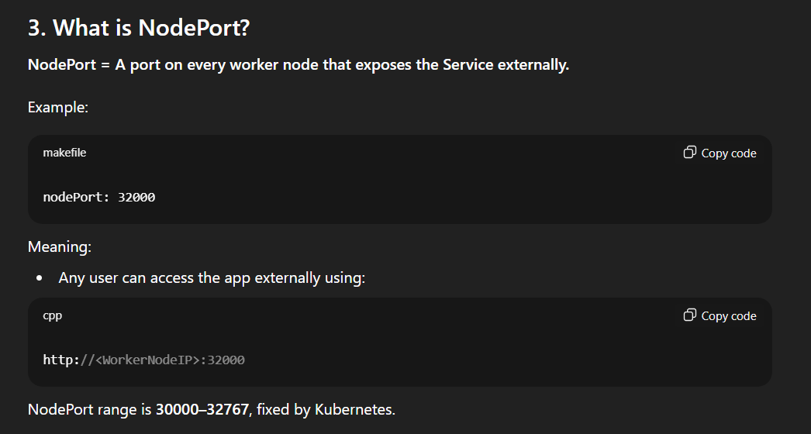
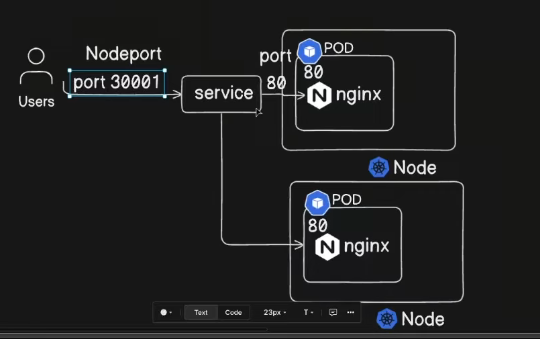

- So far, we have only created the Deployment, but it is not yet accessible to external users. Up to this point, we accessed the application internally using the Pod’s or Node’s cluster IP.

- Now, we will expose the frontend application to users by creating a Service. The Service will make the Deployment accessible either within the cluster (ClusterIP) or externally (NodePort / LoadBalancer), depending on the requirement.

---

## Services in Kubernetes



---



- This is a frontend pod and we need expose the pod to the user , that can be achieved by using ```node port```



- Why ```300000``` their is a defined port range 
- And the service exposed internally and which run in a certain port ```80```
- And the another port applciation listen on is port ``80``



- Here nodePort only exposed externally and that forward the traffic to port 80 ( target port ) 
- The internal port 80 ( service ) is used by the  service or other app running in the cluster or node

## Scenario:
    - When a user hit a request to the app it first reach the nodePort but the pod is listening to the port ( 80 ) service pod , if any backend app need to communicate with teh frotned pod by using service pod ( default port is 80 )







---

## now the  scenario multiple pod running in a single node  ( here also teh same scenario )

- But they use IP address to redirect teh traffic using LoadBalancer Algorithms


