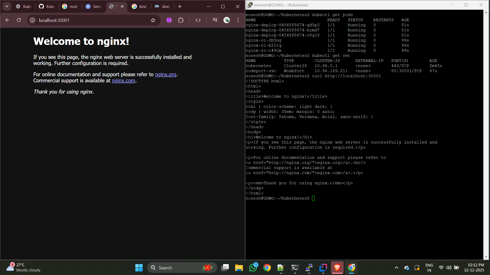

``` yaml
kind: Cluster
apiVersion: kind.x-k8s.io/v1alpha4
nodes:
  - role: control-plane
    extraPortMappings:
      - containerPort: 30001
        hostPort: 30001
  - role: worker
  - role: worker
```
---

``` bash

monesh@GOMO:~/Kubernetes$ ls
check-docker.sh  nodePort.yaml    replicationController.yml  task.yaml
config.yml       pods             stop-docker.sh
deployment.yaml  replicaSet.yaml  task-deploy.yaml
monesh@GOMO:~/Kubernetes$ vim kind.yaml
monesh@GOMO:~/Kubernetes$
monesh@GOMO:~/Kubernetes$ kind create cluster --name cka-cluster --config kind.yaml
Creating cluster "cka-cluster" ...
 ✓ Ensuring node image (kindest/node:v1.27.3) 🖼
 ✓ Preparing nodes 📦 📦 📦
 ✓ Writing configuration 📜
 ✓ Starting control-plane 🕹️
 ✓ Installing CNI 🔌
 ✓ Installing StorageClass 💾
 ✓ Joining worker nodes 🚜
Set kubectl context to "kind-cka-cluster"
You can now use your cluster with:

kubectl cluster-info --context kind-cka-cluster

Have a question, bug, or feature request? Let us know! https://kind.sigs.k8s.io/#community 🙂
monesh@GOMO:~/Kubernetes$ cat replicationController.yml
apiVersion: v1
kind: ReplicationController
metadata:
  name: nginx-rc
  labels:
    env: demo
spec:
  replicas: 3
  template:
    metadata:
      labels:
        env: demo
    spec:
      containers:
        - name: nginx
          image: nginx
monesh@GOMO:~/Kubernetes$ kubectl apply -f replicationController.yml
replicationcontroller/nginx-rc created
monesh@GOMO:~/Kubernetes$ cat deployment.yaml
apiVersion: apps/v1
kind: Deployment
metadata:
  name: nginx-deploy
  labels:
    env: demo
spec:
  replicas: 3
  selector:
    matchLabels:
      env: demo
  template:
    metadata:
      labels:
        env: demo
    spec:
      containers:
        - name: nginx
          image: nginx
monesh@GOMO:~/Kubernetes$ kubectl apply -f deployment.yaml
deployment.apps/nginx-deploy created
monesh@GOMO:~/Kubernetes$ cat nodePort.yaml
apiVersion: v1
kind: Service
metadata:
  name: nodeport-svc
  labels:
    env: demo
spec:
  type: NodePort
  selector:
    env: demo
  ports:
    - port: 80
      targetPort: 80
      nodePort: 30001

monesh@GOMO:~/Kubernetes$ kubectl apply -f nodePort.yaml
service/nodeport-svc created
monesh@GOMO:~/Kubernetes$


```


### All working now ( In both node & host node )

