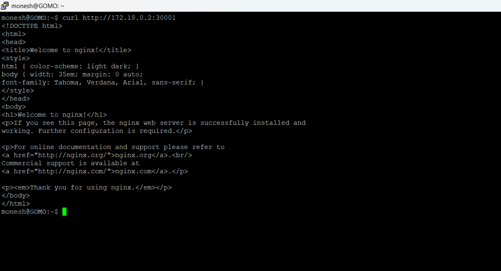
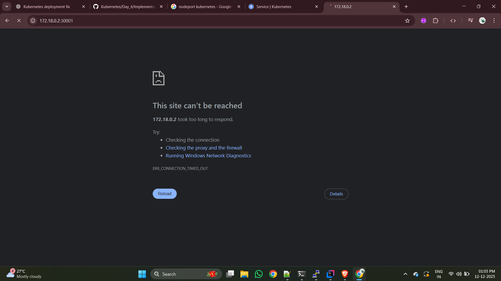

``` text

monesh@GOMO:~$ kubectl get pods
NAME                     READY   STATUS    RESTARTS      AGE
nginx-5d44b9f45b-9jv5b   1/1     Running   2 (55m ago)   18h
nginx-5d44b9f45b-fvl4m   1/1     Running   2 (55m ago)   18h
nginx-5d44b9f45b-n5v6l   1/1     Running   2 (55m ago)   18h
nginx-5d44b9f45b-xm5sd   1/1     Running   2 (55m ago)   18h
nginx-5d44b9f45b-xtn8q   1/1     Running   2 (55m ago)   18h
task-nginx-2q8tj         1/1     Running   2 (55m ago)   18h
task-nginx-5k2d5         1/1     Running   2 (55m ago)   18h
task-nginx-hwsqf         1/1     Running   2 (55m ago)   18h
task-nginx-mj4zp         1/1     Running   2 (55m ago)   18h
task-nginx-wq8h9         1/1     Running   2 (55m ago)   18h
task-nginx-zbhqf         1/1     Running   2 (55m ago)   18h
monesh@GOMO:~$ kubectl describe pod nginx-5d44b9f45b-xm5sd
Name:             nginx-5d44b9f45b-xm5sd
Namespace:        default
Priority:         0
Service Account:  default
Node:             test-cluster-control-plane/172.18.0.2
Start Time:       Thu, 11 Dec 2025 18:08:29 +0530
Labels:           app=v1
                  pod-template-hash=5d44b9f45b
Annotations:      <none>
Status:           Running
IP:               10.244.0.5
IPs:
  IP:           10.244.0.5
Controlled By:  ReplicaSet/nginx-5d44b9f45b
Containers:
  nginx:
    Container ID:   containerd://1ce8fe55da9f92b8d57f2be47bf22b30a882f24e0ae9d93bb0691eb83e7d2d1f
    Image:          nginx:1.23.0
    Image ID:       docker.io/library/nginx@sha256:db345982a2f2a4257c6f699a499feb1d79451a1305e8022f16456ddc3ad6b94c
    Port:           <none>
    Host Port:      <none>
    State:          Running
      Started:      Fri, 12 Dec 2025 11:47:10 +0530
    Last State:     Terminated
      Reason:       Unknown
      Exit Code:    255
      Started:      Thu, 11 Dec 2025 22:26:22 +0530
      Finished:     Fri, 12 Dec 2025 11:47:00 +0530
    Ready:          True
    Restart Count:  2
    Environment:    <none>
    Mounts:
      /var/run/secrets/kubernetes.io/serviceaccount from kube-api-access-qkz4g (ro)
Conditions:
  Type              Status
  Initialized       True
  Ready             True
  ContainersReady   True
  PodScheduled      True
Volumes:
  kube-api-access-qkz4g:
    Type:                    Projected (a volume that contains injected data from multiple sources)
    TokenExpirationSeconds:  3607
    ConfigMapName:           kube-root-ca.crt
    Optional:                false
    DownwardAPI:             true
QoS Class:                   BestEffort
Node-Selectors:              <none>
Tolerations:                 node.kubernetes.io/not-ready:NoExecute op=Exists for 300s
                             node.kubernetes.io/unreachable:NoExecute op=Exists for 300s
Events:
  Type    Reason          Age   From     Message
  ----    ------          ----  ----     -------
  Normal  SandboxChanged  55m   kubelet  Pod sandbox changed, it will be killed and re-created.
  Normal  Pulled          55m   kubelet  Container image "nginx:1.23.0" already present on machine
  Normal  Created         55m   kubelet  Created container nginx
  Normal  Started         55m   kubelet  Started container nginx
monesh@GOMO:~$ cd Kubernetes
monesh@GOMO:~/Kubernetes$ ls
check-docker.sh  config.yml  deployment.yaml  pods  replicaSet.yaml  replicationController.yml  stop-docker.sh  task-deploy.yaml  task.yaml
monesh@GOMO:~/Kubernetes$ cat replicaSet.yaml
apiVersion: apps/v1
kind: ReplicaSet
metadata:
  name: nginx-rs
  labels:
    env: demo
spec:
  replicas: 3
  selector:
    matchLabels:
      env: demo
  template:
    metadata:
      labels:
        env: demo
    spec:
      containers:
        - name: nginx
          image: nginx
```

``` text
monesh@GOMO:~/Kubernetes$ kubectl  explain service
KIND:       Service
VERSION:    v1

DESCRIPTION:
    Service is a named abstraction of software service (for example, mysql)
    consisting of local port (for example 3306) that the proxy listens on, and
    the selector that determines which pods will answer requests sent through
    the proxy.

FIELDS:
  apiVersion    <string>
    APIVersion defines the versioned schema of this representation of an object.
    Servers should convert recognized schemas to the latest internal value, and
    may reject unrecognized values. More info:
    https://git.k8s.io/community/contributors/devel/sig-architecture/api-conventions.md#resources

  kind  <string>
    Kind is a string value representing the REST resource this object
    represents. Servers may infer this from the endpoint the client submits
    requests to. Cannot be updated. In CamelCase. More info:
    https://git.k8s.io/community/contributors/devel/sig-architecture/api-conventions.md#types-kinds

  metadata      <ObjectMeta>
    Standard object's metadata. More info:
    https://git.k8s.io/community/contributors/devel/sig-architecture/api-conventions.md#metadata

  spec  <ServiceSpec>
    Spec defines the behavior of a service.
    https://git.k8s.io/community/contributors/devel/sig-architecture/api-conventions.md#spec-and-status

  status        <ServiceStatus>
    Most recently observed status of the service. Populated by the system.
    Read-only. More info:
    https://git.k8s.io/community/contributors/devel/sig-architecture/api-conventions.md#spec-and-status


monesh@GOMO:~/Kubernetes$ kubeclt get pods --show-labels

Command 'kubeclt' not found, did you mean:

  command 'kubectl' from snap kubectl (1.34.2)

See 'snap info <snapname>' for additional versions.

monesh@GOMO:~/Kubernetes$ kubectl get pods --show-labels
NAME                     READY   STATUS    RESTARTS      AGE   LABELS
nginx-5d44b9f45b-9jv5b   1/1     Running   2 (66m ago)   18h   app=v1,pod-template-hash=5d44b9f45b
nginx-5d44b9f45b-fvl4m   1/1     Running   2 (66m ago)   18h   app=v1,pod-template-hash=5d44b9f45b
nginx-5d44b9f45b-n5v6l   1/1     Running   2 (66m ago)   18h   app=v1,pod-template-hash=5d44b9f45b
nginx-5d44b9f45b-xm5sd   1/1     Running   2 (66m ago)   18h   app=v1,pod-template-hash=5d44b9f45b
nginx-5d44b9f45b-xtn8q   1/1     Running   2 (66m ago)   18h   app=v1,pod-template-hash=5d44b9f45b
task-nginx-2q8tj         1/1     Running   2 (66m ago)   19h   env=task-app
task-nginx-5k2d5         1/1     Running   2 (66m ago)   19h   env=task-app
task-nginx-hwsqf         1/1     Running   2 (66m ago)   19h   env=task-app
task-nginx-mj4zp         1/1     Running   2 (66m ago)   19h   env=task-app
task-nginx-wq8h9         1/1     Running   2 (66m ago)   19h   env=task-app
task-nginx-zbhqf         1/1     Running   2 (66m ago)   19h   env=task-app
monesh@GOMO:~/Kubernetes$ vim nodePort.yaml
monesh@GOMO:~/Kubernetes$ cat nodePort.yaml
apiVersion: v1
kind: Service
metadata:
  name: nodeport-svc
  labels:
    env: demo
spec:
  type: NodePort
  selector:
    app: v1
  ports:
    - port: 80
      targetPort: 80
      nodePort: 30001
monesh@GOMO:~/Kubernetes$ ls
check-docker.sh  config.yml  deployment.yaml  nodePort.yaml  pods  replicaSet.yaml  replicationController.yml  stop-docker.sh  task-deploy.yaml  task.yaml
monesh@GOMO:~/Kubernetes$ kubectl apply -f nodePort.yaml
service/nodeport-svc created
monesh@GOMO:~/Kubernetes$

```
```text
monesh@GOMO:~/Kubernetes$ ls
check-docker.sh  nodePort.yaml    replicationController.yml  task.yaml
config.yml       pods             stop-docker.sh
deployment.yaml  replicaSet.yaml  task-deploy.yaml
monesh@GOMO:~/Kubernetes$ kubectl get svc
NAME           TYPE        CLUSTER-IP      EXTERNAL-IP   PORT(S)        AGE
kubernetes     ClusterIP   10.96.0.1       <none>        443/TCP        3d22h
nodeport-svc   NodePort    10.96.237.155   <none>        80:30001/TCP   2m4s
monesh@GOMO:~/Kubernetes$ kubeclt get pod -o wide

Command 'kubeclt' not found, did you mean:

  command 'kubectl' from snap kubectl (1.34.2)

See 'snap info <snapname>' for additional versions.

monesh@GOMO:~/Kubernetes$ kubeclt get pod -o wide

Command 'kubeclt' not found, did you mean:

  command 'kubectl' from snap kubectl (1.34.2)

See 'snap info <snapname>' for additional versions.

monesh@GOMO:~/Kubernetes$ kubectl get pod -o wide
NAME                     READY   STATUS    RESTARTS      AGE   IP            NODE                         NOMINATED NODE   READINESS GATES
nginx-5d44b9f45b-9jv5b   1/1     Running   2 (71m ago)   18h   10.244.0.11   test-cluster-control-plane   <none>           <none>
nginx-5d44b9f45b-fvl4m   1/1     Running   2 (71m ago)   18h   10.244.0.10   test-cluster-control-plane   <none>           <none>
nginx-5d44b9f45b-n5v6l   1/1     Running   2 (71m ago)   18h   10.244.0.8    test-cluster-control-plane   <none>           <none>
nginx-5d44b9f45b-xm5sd   1/1     Running   2 (71m ago)   18h   10.244.0.5    test-cluster-control-plane   <none>           <none>
nginx-5d44b9f45b-xtn8q   1/1     Running   2 (71m ago)   18h   10.244.0.14   test-cluster-control-plane   <none>           <none>
task-nginx-2q8tj         1/1     Running   2 (71m ago)   19h   10.244.0.9    test-cluster-control-plane   <none>           <none>
task-nginx-5k2d5         1/1     Running   2 (71m ago)   19h   10.244.0.15   test-cluster-control-plane   <none>           <none>
task-nginx-hwsqf         1/1     Running   2 (71m ago)   19h   10.244.0.12   test-cluster-control-plane   <none>           <none>
task-nginx-mj4zp         1/1     Running   2 (71m ago)   19h   10.244.0.13   test-cluster-control-plane   <none>           <none>
task-nginx-wq8h9         1/1     Running   2 (71m ago)   19h   10.244.0.3    test-cluster-control-plane   <none>           <none>
task-nginx-zbhqf         1/1     Running   2 (71m ago)   19h   10.244.0.7    test-cluster-control-plane   <none>           <none>
monesh@GOMO:~/Kubernetes$
```
- Take any IP of the node not the pod 

```text

monesh@GOMO:~/Kubernetes$ kubectl get service
NAME           TYPE        CLUSTER-IP      EXTERNAL-IP   PORT(S)        AGE
kubernetes     ClusterIP   10.96.0.1       <none>        443/TCP        3d22h
nodeport-svc   NodePort    10.96.237.155   <none>        80:30001/TCP   4m15s
monesh@GOMO:~/Kubernetes$ kubectl describe pod nginx-5d44b9f45b-9jv5b
Name:             nginx-5d44b9f45b-9jv5b
Namespace:        default
Priority:         0
Service Account:  default
Node:             test-cluster-control-plane/172.18.0.2
Start Time:       Thu, 11 Dec 2025 18:08:27 +0530
Labels:           app=v1
                  pod-template-hash=5d44b9f45b
Annotations:      <none>
Status:           Running
IP:               10.244.0.11
IPs:
  IP:           10.244.0.11
Controlled By:  ReplicaSet/nginx-5d44b9f45b
Containers:
  nginx:
    Container ID:   containerd://bef7a2dd73fc4185f0abc297a0b7eab3dee638cc3e04352b6666ae10b5fdecd1
    Image:          nginx:1.23.0
    Image ID:       docker.io/library/nginx@sha256:db345982a2f2a4257c6f699a499feb1d79451a1305e8022f16456ddc3ad6b94c
    Port:           <none>
    Host Port:      <none>
    State:          Running
      Started:      Fri, 12 Dec 2025 11:47:10 +0530
    Last State:     Terminated
      Reason:       Unknown
      Exit Code:    255
      Started:      Thu, 11 Dec 2025 22:26:22 +0530
      Finished:     Fri, 12 Dec 2025 11:47:00 +0530
    Ready:          True
    Restart Count:  2
    Environment:    <none>
    Mounts:
      /var/run/secrets/kubernetes.io/serviceaccount from kube-api-access-r6ntp (ro)
Conditions:
  Type              Status
  Initialized       True
  Ready             True
  ContainersReady   True
  PodScheduled      True
Volumes:
  kube-api-access-r6ntp:
    Type:                    Projected (a volume that contains injected data from multiple sources)
    TokenExpirationSeconds:  3607
    ConfigMapName:           kube-root-ca.crt
    Optional:                false
    DownwardAPI:             true
QoS Class:                   BestEffort
Node-Selectors:              <none>
Tolerations:                 node.kubernetes.io/not-ready:NoExecute op=Exists for 300s
                             node.kubernetes.io/unreachable:NoExecute op=Exists for 300s
Events:                      <none>
monesh@GOMO:~/Kubernetes$

```

## TroubleShooting

Node port : ``` 172.18.0.2```

- When we try to access the kubernetes nodePort by using teh terminal in same node 



- But when try with another node( browser in my machine) i cant



``` text
    To make the browser access for the NodePort we
     need to config the port mappings 

```
---

---
-  And that is called   ( But create the new Kind cluster , we cant able to remodify the  older kind cluster )
## Mapping ports to the host machine ( Using kind Documentation )
## URL : [DOC](https://kind.sigs.k8s.io/docs/user/quick-start)

---

---


``` yaml
kind: Cluster
apiVersion: kind.x-k8s.io/v1alpha4
nodes:
- role: control-plane
  extraPortMappings:
  - containerPort: 80
    hostPort: 80
    listenAddress: "0.0.0.0" # Optional, defaults to "0.0.0.0"
    protocol: udp # Optional, defaults to tcp

```