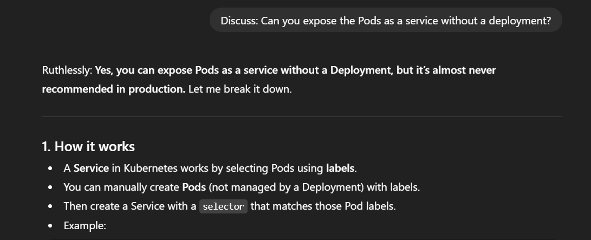
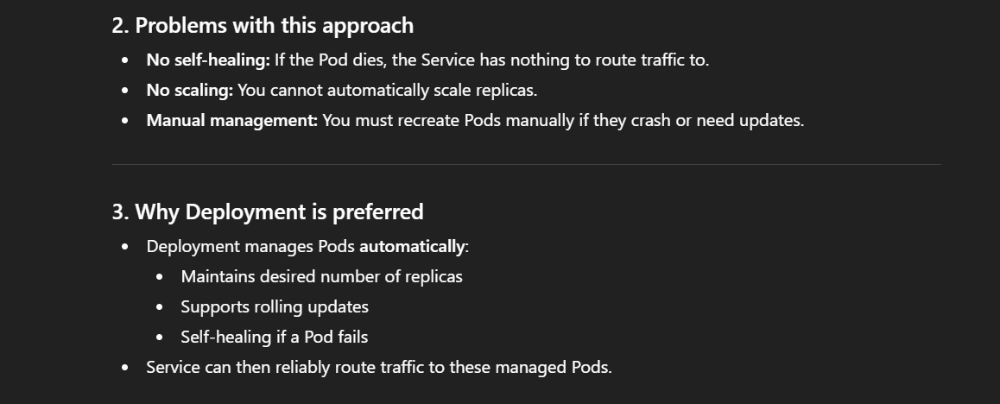
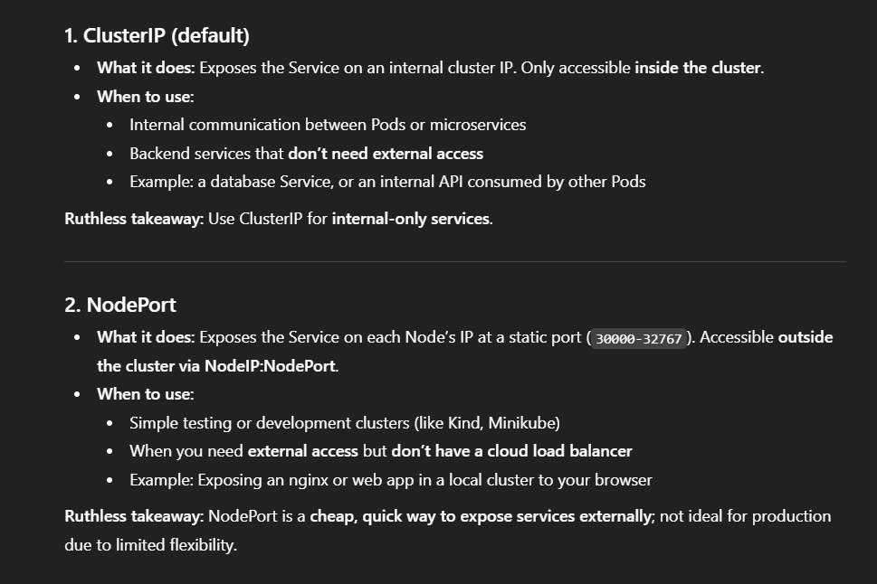
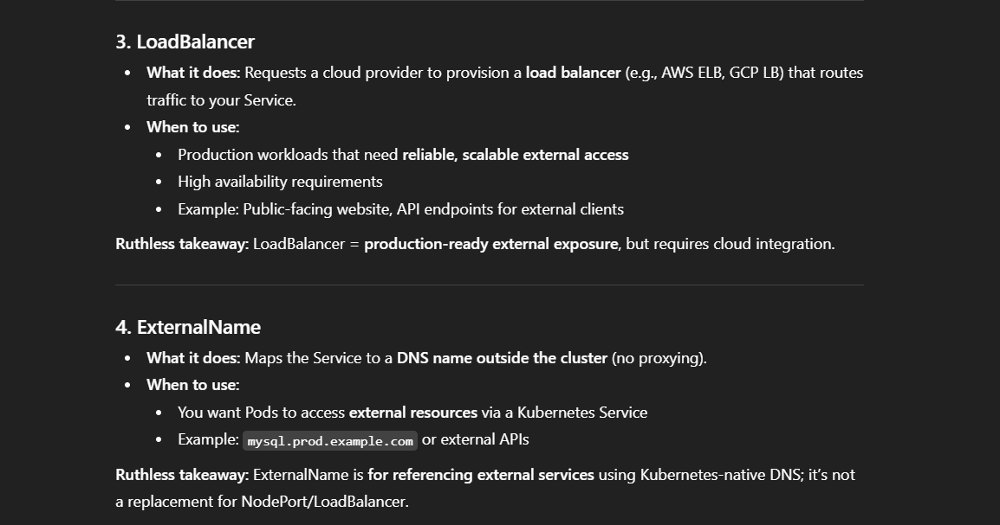

``` yaml
apiVersion: v1
kind: Pod
metadata:
  name: nginx-pod
  labels:
    app: myapp
spec:
  containers:
    - name: nginx
      image: nginx:1.23.4-alpine
      ports:
        - containerPort: 80
```
<br>

``` yaml
apiVersion: v1
kind: Service
metadata:
  name: myapp-svc
spec:
  type: ClusterIP
  selector:
    app: myapp
  ports:
    - port: 80
      targetPort: 80
```




---

Discuss: Under what condition would you use the service types LoadBalancer, node port, clusterIP, and external?






| Service Type | Accessible Where    | Use Case                                      |
| ------------ | ------------------- | --------------------------------------------- |
| ClusterIP    | Inside cluster only | Internal microservices, DBs                   |
| NodePort     | NodeIP:Port         | Dev/test external access                      |
| LoadBalancer | Public cloud IP     | Production external access, HA                |
| ExternalName | DNS outside cluster | Map external services to a Kubernetes Service |


