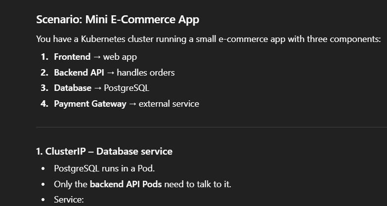
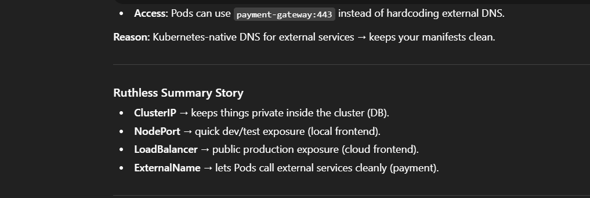

``` yaml
apiVersion: v1
kind: Service
metadata:
  name: db-service
spec:
  type: ClusterIP
  selector:
    app: postgres
  ports:
    - port: 5432
      targetPort: 5432
```


``` yaml
apiVersion: v1
kind: Service
metadata:
  name: frontend-nodeport
spec:
  type: NodePort
  selector:
    app: frontend
  ports:
    - port: 80
      targetPort: 80
      nodePort: 30001
````


``` yaml
apiVersion: v1
kind: Service
metadata:
  name: frontend-lb
spec:
  type: LoadBalancer
  selector:
    app: frontend
  ports:
    - port: 80
      targetPort: 80
```


``` yaml
apiVersion: v1
kind: Service
metadata:
  name: payment-gateway
spec:
  type: ExternalName
  externalName: api.stripe.com
  ports:
    - port: 443
```
