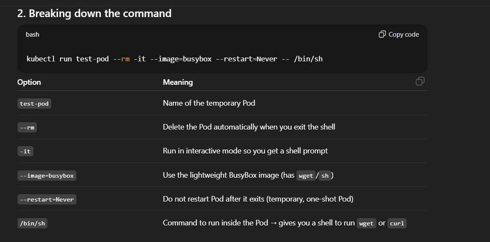
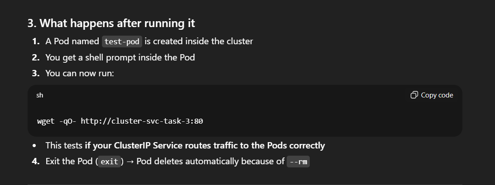
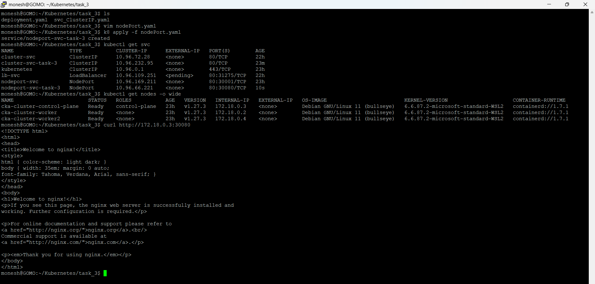
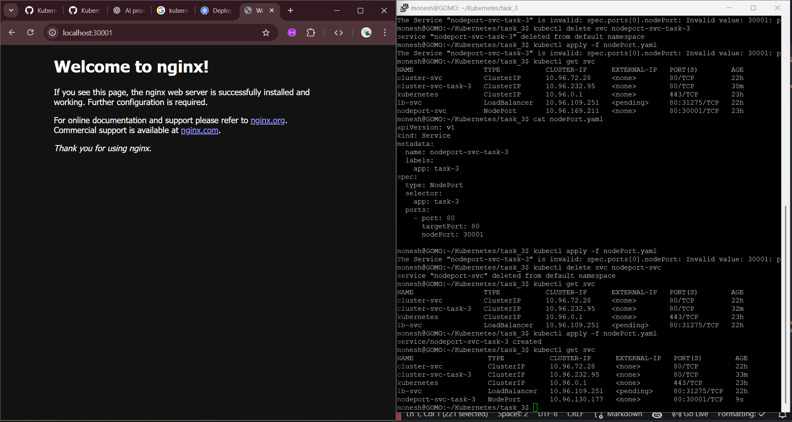

``` bash

monesh@GOMO:~/Kubernetes$ ls
Cluster_IP.yaml  config.yml  deployment.yaml  kind.yaml  lb.yml  nodePort.yaml  pods  replicaSet.yaml  replicationController.yml  task-deploy.yaml  task.yaml
monesh@GOMO:~/Kubernetes$ mkdir task_3
monesh@GOMO:~/Kubernetes$ cd task_3
monesh@GOMO:~/Kubernetes/task_3$ vim deployment.yaml
monesh@GOMO:~/Kubernetes/task_3$ kubectl get deploy
NAME           READY   UP-TO-DATE   AVAILABLE   AGE
nginx-deploy   3/3     3            3           22h
monesh@GOMO:~/Kubernetes/task_3$ kubectl apply -f deployment.yaml
deployment.apps/myapp created
monesh@GOMO:~/Kubernetes/task_3$ kubectl get deploy
NAME           READY   UP-TO-DATE   AVAILABLE   AGE
myapp          0/1     1            0           6s
nginx-deploy   3/3     3            3           22h
monesh@GOMO:~/Kubernetes/task_3$ kubectl get deploy
NAME           READY   UP-TO-DATE   AVAILABLE   AGE
myapp          1/1     1            1           82s
nginx-deploy   3/3     3            3           22h
monesh@GOMO:~/Kubernetes/task_3$ vim svc_ClusterIP.yaml
monesh@GOMO:~/Kubernetes/task_3$ kubectl apply -f svc_ClusterIP.yaml
service/cluster-svc-task-3 created
monesh@GOMO:~/Kubernetes/task_3$ kubectl get svc
NAME                 TYPE           CLUSTER-IP      EXTERNAL-IP   PORT(S)        AGE
cluster-svc          ClusterIP      10.96.72.28     <none>        80/TCP         22h
cluster-svc-task-3   ClusterIP      10.96.232.95    <none>        80/TCP         7s
kubernetes           ClusterIP      10.96.0.1       <none>        443/TCP        23h
lb-svc               LoadBalancer   10.96.109.251   <pending>     80:31275/TCP   22h
nodeport-svc         NodePort       10.96.169.211   <none>        80:30001/TCP   23h
monesh@GOMO:~/Kubernetes/task_3$   kubectl scale --replicas=3 rs/foo
error: no objects passed to scale replicasets.apps "foo" not found
monesh@GOMO:~/Kubernetes/task_3$ k8 scale --replicas=2 deploy/myapp
deployment.apps/myapp scaled
monesh@GOMO:~/Kubernetes/task_3$ kubectl get deploy myapp
NAME    READY   UP-TO-DATE   AVAILABLE   AGE
myapp   2/2     2            2           13m
monesh@GOMO:~/Kubernetes/task_3$

```






``` bash

monesh@GOMO:~/Kubernetes/task_3$ kubectl run test-pod --rm -it --image=busybox --restart=Never -- /bin/sh
All commands and output from this session will be recorded in container logs, including credentials and sensitive information passed through the command prompt.
If you don't see a command prompt, try pressing enter.
/ # wget -qO- http://cluster-svc-task-3:80
<!DOCTYPE html>
<html>
<head>
<title>Welcome to nginx!</title>
<style>
html { color-scheme: light dark; }
body { width: 35em; margin: 0 auto;
font-family: Tahoma, Verdana, Arial, sans-serif; }
</style>
</head>
<body>
<h1>Welcome to nginx!</h1>
<p>If you see this page, the nginx web server is successfully installed and
working. Further configuration is required.</p>

<p>For online documentation and support please refer to
<a href="http://nginx.org/">nginx.org</a>.<br/>
Commercial support is available at
<a href="http://nginx.com/">nginx.com</a>.</p>

<p><em>Thank you for using nginx.</em></p>
</body>
</html>
/ #

```

---

## Now we are going to hit the  ```Cluster_IP``` service from the outside of the cluster 
- Expected : ```ENDPOINT NOT REACHABLE``` reason CLUSTER_IP only communicate inside the cluster 

``` bash

monesh@GOMO:~/Kubernetes/task_3$ kubectl run test-pod --rm -it --image=busybox --restart=Never -- /bin/sh
All commands and output from this session will be recorded in container logs, including credentials and sensitive information passed through the command prompt.
If you don't see a command prompt, try pressing enter.
/ # wget -qO- http://cluster-svc-task-3:80
<!DOCTYPE html>
<html>
<head>
<title>Welcome to nginx!</title>
<style>
html { color-scheme: light dark; }
body { width: 35em; margin: 0 auto;
font-family: Tahoma, Verdana, Arial, sans-serif; }
</style>
</head>
<body>
<h1>Welcome to nginx!</h1>
<p>If you see this page, the nginx web server is successfully installed and
working. Further configuration is required.</p>

<p>For online documentation and support please refer to
<a href="http://nginx.org/">nginx.org</a>.<br/>
Commercial support is available at
<a href="http://nginx.com/">nginx.com</a>.</p>

<p><em>Thank you for using nginx.</em></p>
</body>
</html>
/ # exit
pod "test-pod" deleted from default namespace
monesh@GOMO:~/Kubernetes/task_3$  wget -qO- http://cluster-svc-task-3:80
monesh@GOMO:~/Kubernetes/task_3$

```

## Changing service to ```NODEPORT```

``` bash

monesh@GOMO:~/Kubernetes/task_3$ ls
deployment.yaml  svc_ClusterIP.yaml
monesh@GOMO:~/Kubernetes/task_3$ vim nodePort.yaml
monesh@GOMO:~/Kubernetes/task_3$ k8 apply -f nodePort.yaml
service/nodeport-svc-task-3 created
monesh@GOMO:~/Kubernetes/task_3$ kubectl get svc
NAME                  TYPE           CLUSTER-IP      EXTERNAL-IP   PORT(S)        AGE
cluster-svc           ClusterIP      10.96.72.28     <none>        80/TCP         22h
cluster-svc-task-3    ClusterIP      10.96.232.95    <none>        80/TCP         23m
kubernetes            ClusterIP      10.96.0.1       <none>        443/TCP        23h
lb-svc                LoadBalancer   10.96.109.251   <pending>     80:31275/TCP   22h
nodeport-svc          NodePort       10.96.169.211   <none>        80:30001/TCP   23h
nodeport-svc-task-3   NodePort       10.96.66.221    <none>        80:30080/TCP   10s
monesh@GOMO:~/Kubernetes/task_3$ kubectl get nodes -o wide
NAME                        STATUS   ROLES           AGE   VERSION   INTERNAL-IP   EXTERNAL-IP   OS-IMAGE                         KERNEL-VERSION                     CONTAINER-RUNTIME
cka-cluster-control-plane   Ready    control-plane   23h   v1.27.3   172.18.0.3    <none>        Debian GNU/Linux 11 (bullseye)   6.6.87.2-microsoft-standard-WSL2   containerd://1.7.1
cka-cluster-worker          Ready    <none>          23h   v1.27.3   172.18.0.2    <none>        Debian GNU/Linux 11 (bullseye)   6.6.87.2-microsoft-standard-WSL2   containerd://1.7.1
cka-cluster-worker2         Ready    <none>          23h   v1.27.3   172.18.0.4    <none>        Debian GNU/Linux 11 (bullseye)   6.6.87.2-microsoft-standard-WSL2   containerd://1.7.1
monesh@GOMO:~/Kubernetes/task_3$ curl http://172.18.0.3:30080
<!DOCTYPE html>
<html>
<head>
<title>Welcome to nginx!</title>
<style>
html { color-scheme: light dark; }
body { width: 35em; margin: 0 auto;
font-family: Tahoma, Verdana, Arial, sans-serif; }
</style>
</head>
<body>
<h1>Welcome to nginx!</h1>
<p>If you see this page, the nginx web server is successfully installed and
working. Further configuration is required.</p>

<p>For online documentation and support please refer to
<a href="http://nginx.org/">nginx.org</a>.<br/>
Commercial support is available at
<a href="http://nginx.com/">nginx.com</a>.</p>

<p><em>Thank you for using nginx.</em></p>
</body>
</html>
monesh@GOMO:~/Kubernetes/task_3$

```






``` bash

monesh@GOMO:~/Kubernetes/task_3$ ls
deployment.yaml  svc_ClusterIP.yaml
monesh@GOMO:~/Kubernetes/task_3$ vim nodePort.yaml
monesh@GOMO:~/Kubernetes/task_3$ k8 apply -f nodePort.yaml
service/nodeport-svc-task-3 created
monesh@GOMO:~/Kubernetes/task_3$ kubectl get svc
NAME                  TYPE           CLUSTER-IP      EXTERNAL-IP   PORT(S)        AGE
cluster-svc           ClusterIP      10.96.72.28     <none>        80/TCP         22h
cluster-svc-task-3    ClusterIP      10.96.232.95    <none>        80/TCP         23m
kubernetes            ClusterIP      10.96.0.1       <none>        443/TCP        23h
lb-svc                LoadBalancer   10.96.109.251   <pending>     80:31275/TCP   22h
nodeport-svc          NodePort       10.96.169.211   <none>        80:30001/TCP   23h
nodeport-svc-task-3   NodePort       10.96.66.221    <none>        80:30080/TCP   10s
monesh@GOMO:~/Kubernetes/task_3$ kubectl get nodes -o wide
NAME                        STATUS   ROLES           AGE   VERSION   INTERNAL-IP   EXTERNAL-IP   OS-IMAGE                         KERNEL-VERSION                     CONTAINER-RUNTIME
cka-cluster-control-plane   Ready    control-plane   23h   v1.27.3   172.18.0.3    <none>        Debian GNU/Linux 11 (bullseye)   6.6.87.2-microsoft-standard-WSL2   containerd://1.7.1
cka-cluster-worker          Ready    <none>          23h   v1.27.3   172.18.0.2    <none>        Debian GNU/Linux 11 (bullseye)   6.6.87.2-microsoft-standard-WSL2   containerd://1.7.1
cka-cluster-worker2         Ready    <none>          23h   v1.27.3   172.18.0.4    <none>        Debian GNU/Linux 11 (bullseye)   6.6.87.2-microsoft-standard-WSL2   containerd://1.7.1
monesh@GOMO:~/Kubernetes/task_3$ curl http://172.18.0.3:30080
<!DOCTYPE html>
<html>
<head>
<title>Welcome to nginx!</title>
<style>
html { color-scheme: light dark; }
body { width: 35em; margin: 0 auto;
font-family: Tahoma, Verdana, Arial, sans-serif; }
</style>
</head>
<body>
<h1>Welcome to nginx!</h1>
<p>If you see this page, the nginx web server is successfully installed and
working. Further configuration is required.</p>

<p>For online documentation and support please refer to
<a href="http://nginx.org/">nginx.org</a>.<br/>
Commercial support is available at
<a href="http://nginx.com/">nginx.com</a>.</p>

<p><em>Thank you for using nginx.</em></p>
</body>
</html>
monesh@GOMO:~/Kubernetes/task_3$ vim nodePort.yaml
monesh@GOMO:~/Kubernetes/task_3$ kubectl apply -f nodePort.yaml
The Service "nodeport-svc-task-3" is invalid: spec.ports[0].nodePort: Invalid value: 30001: provided port is already allocated
monesh@GOMO:~/Kubernetes/task_3$ kubectl delete svc nodeport-svc-task-3
service "nodeport-svc-task-3" deleted from default namespace
monesh@GOMO:~/Kubernetes/task_3$ kubectl apply -f nodePort.yaml
The Service "nodeport-svc-task-3" is invalid: spec.ports[0].nodePort: Invalid value: 30001: provided port is already allocated
monesh@GOMO:~/Kubernetes/task_3$ kubectl get svc
NAME                 TYPE           CLUSTER-IP      EXTERNAL-IP   PORT(S)        AGE
cluster-svc          ClusterIP      10.96.72.28     <none>        80/TCP         22h
cluster-svc-task-3   ClusterIP      10.96.232.95    <none>        80/TCP         30m
kubernetes           ClusterIP      10.96.0.1       <none>        443/TCP        23h
lb-svc               LoadBalancer   10.96.109.251   <pending>     80:31275/TCP   22h
nodeport-svc         NodePort       10.96.169.211   <none>        80:30001/TCP   23h
monesh@GOMO:~/Kubernetes/task_3$ cat nodePort.yaml
apiVersion: v1
kind: Service
metadata:
  name: nodeport-svc-task-3
  labels:
    app: task-3
spec:
  type: NodePort
  selector:
    app: task-3
  ports:
    - port: 80
      targetPort: 80
      nodePort: 30001

monesh@GOMO:~/Kubernetes/task_3$ kubectl apply -f nodePort.yaml
The Service "nodeport-svc-task-3" is invalid: spec.ports[0].nodePort: Invalid value: 30001: provided port is already allocated
monesh@GOMO:~/Kubernetes/task_3$ kubectl delete svc nodeport-svc
service "nodeport-svc" deleted from default namespace
monesh@GOMO:~/Kubernetes/task_3$ kubectl get svc
NAME                 TYPE           CLUSTER-IP      EXTERNAL-IP   PORT(S)        AGE
cluster-svc          ClusterIP      10.96.72.28     <none>        80/TCP         22h
cluster-svc-task-3   ClusterIP      10.96.232.95    <none>        80/TCP         32m
kubernetes           ClusterIP      10.96.0.1       <none>        443/TCP        23h
lb-svc               LoadBalancer   10.96.109.251   <pending>     80:31275/TCP   22h
monesh@GOMO:~/Kubernetes/task_3$ kubectl apply -f nodePort.yaml
service/nodeport-svc-task-3 created
monesh@GOMO:~/Kubernetes/task_3$ kubectl get svc
NAME                  TYPE           CLUSTER-IP      EXTERNAL-IP   PORT(S)        AGE
cluster-svc           ClusterIP      10.96.72.28     <none>        80/TCP         22h
cluster-svc-task-3    ClusterIP      10.96.232.95    <none>        80/TCP         33m
kubernetes            ClusterIP      10.96.0.1       <none>        443/TCP        23h
lb-svc                LoadBalancer   10.96.109.251   <pending>     80:31275/TCP   22h
nodeport-svc-task-3   NodePort       10.96.130.177   <none>        80:30001/TCP   9s
monesh@GOMO:~/Kubernetes/task_3$

```