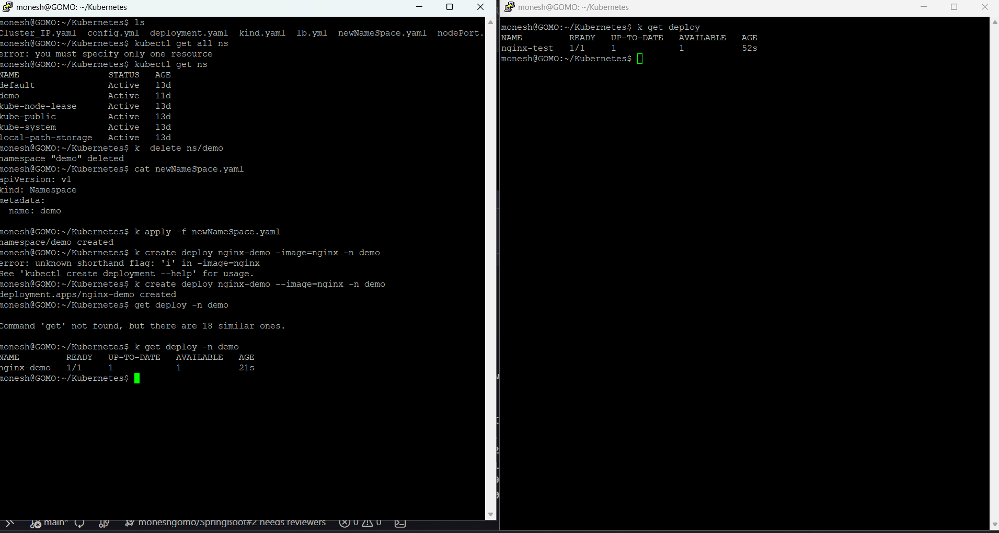

- By default when we creating the namespace the deafult name is default

``` bash

monesh@GOMO:~/Kubernetes$ k get ns
NAME                 STATUS   AGE
default              Active   13d
demo                 Active   11d
kube-node-lease      Active   13d
kube-public          Active   13d
kube-system          Active   13d
local-path-storage   Active   13d
monesh@GOMO:~/Kubernetes$
monesh@GOMO:~/Kubernetes$ k get all --namespace=kube-system
NAME                                                    READY   STATUS    RESTARTS        AGE
pod/coredns-5d78c9869d-5xjq4                            1/1     Running   4 (9m23s ago)   13d
pod/coredns-5d78c9869d-9x75f                            1/1     Running   4 (9m23s ago)   13d
pod/etcd-cka-cluster-control-plane                      1/1     Running   0               9m15s
pod/kindnet-j5m4k                                       1/1     Running   4 (9m25s ago)   13d
pod/kindnet-ln8n9                                       1/1     Running   4 (9m23s ago)   13d
pod/kindnet-zbpcx                                       1/1     Running   4 (9m25s ago)   13d
pod/kube-apiserver-cka-cluster-control-plane            1/1     Running   0               9m15s
pod/kube-controller-manager-cka-cluster-control-plane   1/1     Running   7 (9m23s ago)   13d
pod/kube-proxy-6ldln                                    1/1     Running   4 (9m25s ago)   13d
pod/kube-proxy-fg769                                    1/1     Running   4 (9m25s ago)   13d
pod/kube-proxy-lkcm6                                    1/1     Running   4 (9m23s ago)   13d
pod/kube-scheduler-cka-cluster-control-plane            1/1     Running   6 (9m23s ago)   13d

NAME               TYPE        CLUSTER-IP   EXTERNAL-IP   PORT(S)                  AGE
service/kube-dns   ClusterIP   10.96.0.10   <none>        53/UDP,53/TCP,9153/TCP   13d

NAME                        DESIRED   CURRENT   READY   UP-TO-DATE   AVAILABLE   NODE SELECTOR            AGE
daemonset.apps/kindnet      3         3         3       3            3           kubernetes.io/os=linux   13d
daemonset.apps/kube-proxy   3         3         3       3            3           kubernetes.io/os=linux   13d

NAME                      READY   UP-TO-DATE   AVAILABLE   AGE
deployment.apps/coredns   2/2     2            2           13d

NAME                                 DESIRED   CURRENT   READY   AGE
replicaset.apps/coredns-5d78c9869d   2         2         2       13d
monesh@GOMO:~/Kubernetes$
monesh@GOMO:~/Kubernetes$ k get all -n=default
NAME                                READY   STATUS    RESTARTS      AGE
pod/myapp-7d45cf4c47-b98lm          1/1     Running   3 (10m ago)   12d
pod/myapp-7d45cf4c47-jx9cn          1/1     Running   3 (10m ago)   12d
pod/nginx-demo-7c7dd79bb7-46kdx     1/1     Running   2 (10m ago)   11d
pod/nginx-demo-7c7dd79bb7-4z4s7     1/1     Running   2 (10m ago)   11d
pod/nginx-demo-7c7dd79bb7-ggzf7     1/1     Running   2 (10m ago)   11d
pod/nginx-deploy-84568f8674-gd5p2   1/1     Running   4 (10m ago)   13d
pod/nginx-deploy-84568f8674-hcmd7   1/1     Running   4 (10m ago)   13d
pod/nginx-deploy-84568f8674-r8gj8   1/1     Running   4 (10m ago)   13d
pod/nginx-rc-2b5ng                  1/1     Running   4 (10m ago)   13d
pod/nginx-rc-b2ltq                  1/1     Running   4 (10m ago)   13d
pod/nginx-rc-c49cm                  1/1     Running   4 (10m ago)   13d

NAME                             DESIRED   CURRENT   READY   AGE
replicationcontroller/nginx-rc   3         3         3       13d

NAME                          TYPE           CLUSTER-IP      EXTERNAL-IP   PORT(S)        AGE
service/cluster-svc           ClusterIP      10.96.72.28     <none>        80/TCP         13d
service/cluster-svc-task-3    ClusterIP      10.96.232.95    <none>        80/TCP         12d
service/kubernetes            ClusterIP      10.96.0.1       <none>        443/TCP        13d
service/lb-svc                LoadBalancer   10.96.109.251   <pending>     80:31275/TCP   13d
service/nodeport-svc-task-3   NodePort       10.96.130.177   <none>        80:30001/TCP   12d
service/svc-default           ClusterIP      10.96.234.109   <none>        80/TCP         11d

NAME                           READY   UP-TO-DATE   AVAILABLE   AGE
deployment.apps/myapp          2/2     2            2           12d
deployment.apps/nginx-demo     3/3     3            3           11d
deployment.apps/nginx-deploy   3/3     3            3           13d

NAME                                      DESIRED   CURRENT   READY   AGE
replicaset.apps/myapp-7d45cf4c47          2         2         2       12d
replicaset.apps/nginx-demo-7c7dd79bb7     3         3         3       11d
replicaset.apps/nginx-deploy-84568f8674   3         3         3       13d
monesh@GOMO:~/Kubernetes$


```
- When we provison a k8 cluster itself it create some clusters like
	- kube-system (componets of k8 are created in the kube-system ) cluster why ? to keep away from delete and modify the cluster from users 

	- And we can able to assign different permissions and pods in namespace

---

when two different clusters needs to communicate with eachother they cant directly able to communicate , in place they use ( FQD: Fully Qualified Domain Name ) 


----





## Point to note 

``` bash

By using the IPs of two different namespace we can able to reach the another namespace from one namespace 

But when we try to reach teh pod from one to another using service  cluster_ip at that time we dont use the host name we use the fully qualified domain name 

```

