``` bash

monesh@GOMO:~$ k get ns
NAME                 STATUS   AGE
default              Active   38h
kube-node-lease      Active   38h
kube-public          Active   38h
kube-system          Active   38h
local-path-storage   Active   38h
monesh@GOMO:~$

```

- default : Is sued by us 
- kube-sys : kubernetes to maage the CONTROL PLANE components 
  
``` bash
monesh@GOMO:~$ k get all --namespace=kube-system
NAME                                                    READY   STATUS    RESTARTS        AGE
pod/coredns-5d78c9869d-5xjq4                            1/1     Running   2 (5m59s ago)   38h
pod/coredns-5d78c9869d-9x75f                            1/1     Running   2 (5m59s ago)   38h
pod/etcd-cka-cluster-control-plane                      1/1     Running   0               5m52s
pod/kindnet-j5m4k                                       1/1     Running   2 (5m59s ago)   38h
pod/kindnet-ln8n9                                       1/1     Running   2 (5m59s ago)   38h
pod/kindnet-zbpcx                                       1/1     Running   2 (5m59s ago)   38h
pod/kube-apiserver-cka-cluster-control-plane            1/1     Running   0               5m52s
pod/kube-controller-manager-cka-cluster-control-plane   1/1     Running   5 (5m59s ago)   38h
pod/kube-proxy-6ldln                                    1/1     Running   2 (5m59s ago)   38h
pod/kube-proxy-fg769                                    1/1     Running   2 (5m59s ago)   38h
pod/kube-proxy-lkcm6                                    1/1     Running   2 (5m59s ago)   38h
pod/kube-scheduler-cka-cluster-control-plane            1/1     Running   4 (5m59s ago)   38h

NAME               TYPE        CLUSTER-IP   EXTERNAL-IP   PORT(S)                  AGE
service/kube-dns   ClusterIP   10.96.0.10   <none>        53/UDP,53/TCP,9153/TCP   38h

NAME                        DESIRED   CURRENT   READY   UP-TO-DATE   AVAILABLE   NODE SELECTOR            AGE
daemonset.apps/kindnet      3         3         3       3            3           kubernetes.io/os=linux   38h
daemonset.apps/kube-proxy   3         3         3       3            3           kubernetes.io/os=linux   38h

NAME                      READY   UP-TO-DATE   AVAILABLE   AGE
deployment.apps/coredns   2/2     2            2           38h

NAME                                 DESIRED   CURRENT   READY   AGE
replicaset.apps/coredns-5d78c9869d   2         2         2       38h
monesh@GOMO:~$ k get all -n kube-public
No resources found in kube-public namespace.
monesh@GOMO:~$ k get all -n default
NAME                                READY   STATUS    RESTARTS        AGE
pod/myapp-7d45cf4c47-b98lm          1/1     Running   1 (8m34s ago)   15h
pod/myapp-7d45cf4c47-jx9cn          1/1     Running   1 (8m34s ago)   15h
pod/nginx-deploy-84568f8674-gd5p2   1/1     Running   2 (8m34s ago)   38h
pod/nginx-deploy-84568f8674-hcmd7   1/1     Running   2 (8m34s ago)   38h
pod/nginx-deploy-84568f8674-r8gj8   1/1     Running   2 (8m34s ago)   38h
pod/nginx-rc-2b5ng                  1/1     Running   2 (8m34s ago)   38h
pod/nginx-rc-b2ltq                  1/1     Running   2 (8m34s ago)   38h
pod/nginx-rc-c49cm                  1/1     Running   2 (8m34s ago)   38h

NAME                             DESIRED   CURRENT   READY   AGE
replicationcontroller/nginx-rc   3         3         3       38h

NAME                          TYPE           CLUSTER-IP      EXTERNAL-IP   PORT(S)        AGE
service/cluster-svc           ClusterIP      10.96.72.28     <none>        80/TCP         38h
service/cluster-svc-task-3    ClusterIP      10.96.232.95    <none>        80/TCP         15h
service/kubernetes            ClusterIP      10.96.0.1       <none>        443/TCP        38h
service/lb-svc                LoadBalancer   10.96.109.251   <pending>     80:31275/TCP   37h
service/nodeport-svc-task-3   NodePort       10.96.130.177   <none>        80:30001/TCP   15h

NAME                           READY   UP-TO-DATE   AVAILABLE   AGE
deployment.apps/myapp          2/2     2            2           15h
deployment.apps/nginx-deploy   3/3     3            3           38h

NAME                                      DESIRED   CURRENT   READY   AGE
replicaset.apps/myapp-7d45cf4c47          2         2         2       15h
replicaset.apps/nginx-deploy-84568f8674   3         3         3       38h
monesh@GOMO:~$
```
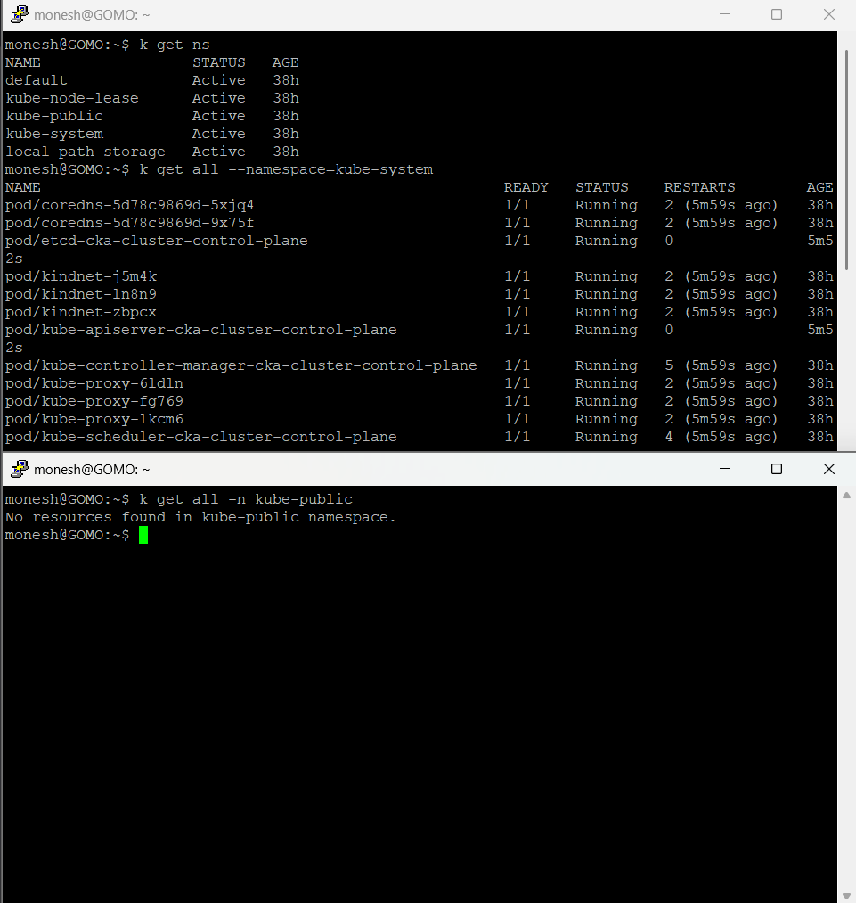

---

## Creating new NameSpace


``` bash

apiVersion: v1
kind: Namespace
metadata:
  name: demo

monesh@GOMO:~/Kubernetes$ kubectl apply -f newNameSpace.yaml
namespace/demo created
monesh@GOMO:~/Kubernetes$ kubectl get svc
NAME                  TYPE           CLUSTER-IP      EXTERNAL-IP   PORT(S)        AGE
cluster-svc           ClusterIP      10.96.72.28     <none>        80/TCP         38h
cluster-svc-task-3    ClusterIP      10.96.232.95    <none>        80/TCP         15h
kubernetes            ClusterIP      10.96.0.1       <none>        443/TCP        38h
lb-svc                LoadBalancer   10.96.109.251   <pending>     80:31275/TCP   37h
nodeport-svc-task-3   NodePort       10.96.130.177   <none>        80:30001/TCP   15h
monesh@GOMO:~/Kubernetes$ kubectl get ns
NAME                 STATUS   AGE
default              Active   38h
demo                 Active   20s
kube-node-lease      Active   38h
kube-public          Active   38h
kube-system          Active   38h
local-path-storage   Active   38h
monesh@GOMO:~/Kubernetes$ k delete ns/demo
namespace "demo" deleted
onesh@GOMO:~/Kubernetes$ k create deploy --help
Create a deployment with the specified name.

Aliases:
deployment, deploy

Examples:
  # Create a deployment named my-dep that runs the busybox image
  kubectl create deployment my-dep --image=busybox

  # Create a deployment with a command
  kubectl create deployment my-dep --image=busybox -- date

  # Create a deployment named my-dep that runs the nginx image with 3 replicas
  kubectl create deployment my-dep --image=nginx --replicas=3

  # Create a deployment named my-dep that runs the busybox image and expose port
5701
  kubectl create deployment my-dep --image=busybox --port=5701

  # Create a deployment named my-dep that runs multiple containers
  kubectl create deployment my-dep --image=busybox:latest --image=ubuntu:latest
--image=nginx

Options:
    --allow-missing-template-keys=true:
        If true, ignore any errors in templates when a field or map key is
        missing in the template. Only applies to golang and jsonpath output
        formats.

    --dry-run='none':
        Must be "none", "server", or "client". If client strategy, only print
        the object that would be sent, without sending it. If server strategy,
        submit server-side request without persisting the resource.

    --field-manager='kubectl-create':
        Name of the manager used to track field ownership.

    --image=[]:
        Image names to run. A deployment can have multiple images set for
        multi-container pod.

    -o, --output='':
        Output format. One of: (json, yaml, name, go-template,
        go-template-file, template, templatefile, jsonpath, jsonpath-as-json,
        jsonpath-file).

    --port=-1:
        The containerPort that this deployment exposes.

    -r, --replicas=1:
        Number of replicas to create. Default is 1.

    --save-config=false:
        If true, the configuration of current object will be saved in its
        annotation. Otherwise, the annotation will be unchanged. This flag is
        useful when you want to perform kubectl apply on this object in the
        future.

    --show-managed-fields=false:
        If true, keep the managedFields when printing objects in JSON or YAML
        format.

    --template='':
        Template string or path to template file to use when -o=go-template,
        -o=go-template-file. The template format is golang templates
        [http://golang.org/pkg/text/template/#pkg-overview].

    --validate='strict':
        Must be one of: strict (or true), warn, ignore (or false). "true" or
        "strict" will use a schema to validate the input and fail the request
        if invalid. It will perform server side validation if
        ServerSideFieldValidation is enabled on the api-server, but will fall
        back to less reliable client-side validation if not. "warn" will warn
        about unknown or duplicate fields without blocking the request if
        server-side field validation is enabled on the API server, and behave
        as "ignore" otherwise. "false" or "ignore" will not perform any schema
        validation, silently dropping any unknown or duplicate fields.

Usage:
  kubectl create deployment NAME --image=image -- [COMMAND] [args...] [options]

Use "kubectl options" for a list of global command-line options (applies to all
commands).
monesh@GOMO:~/Kubernetes$ k create deploy nginx-demo --image=nginx -n demo
error: failed to create deployment: namespaces "demo" not found
monesh@GOMO:~/Kubernetes$ k create ns demo
namespace/demo created
monesh@GOMO:~/Kubernetes$ k create deploy nginx-demo --image=nginx -n demo
deployment.apps/nginx-demo created
monesh@GOMO:~/Kubernetes$ k get deploy
NAME           READY   UP-TO-DATE   AVAILABLE   AGE
myapp          2/2     2            2           16h
nginx-deploy   3/3     3            3           38h
monesh@GOMO:~/Kubernetes$ k get deploy -n demo
NAME         READY   UP-TO-DATE   AVAILABLE   AGE
nginx-demo   1/1     1            1           33s
monesh@GOMO:~/Kubernetes$
```

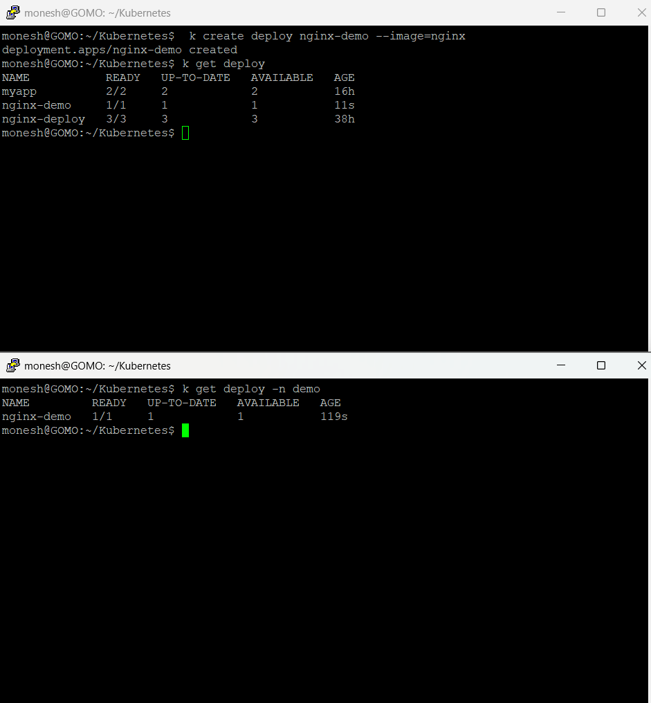

- Now we used to interact with the ```demo-ns```

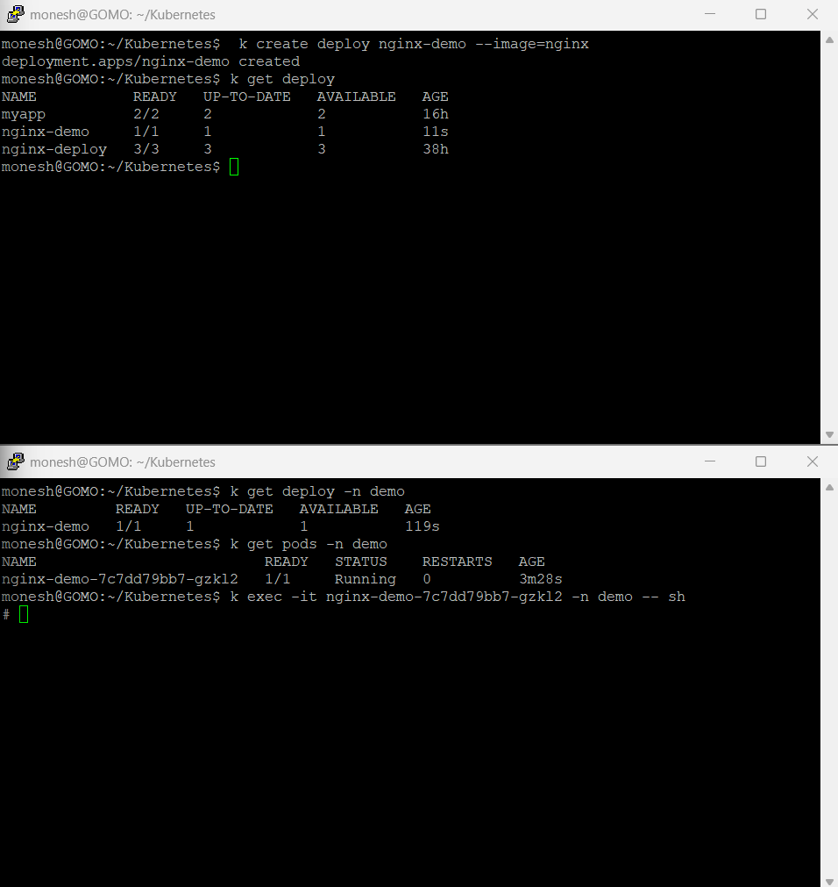

- now same for ```default-ns```
  
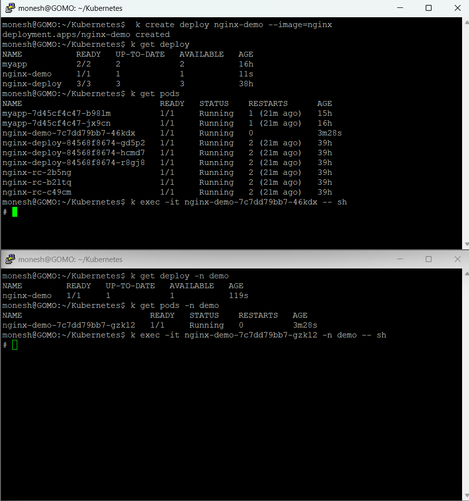

## Grab the IP in both 

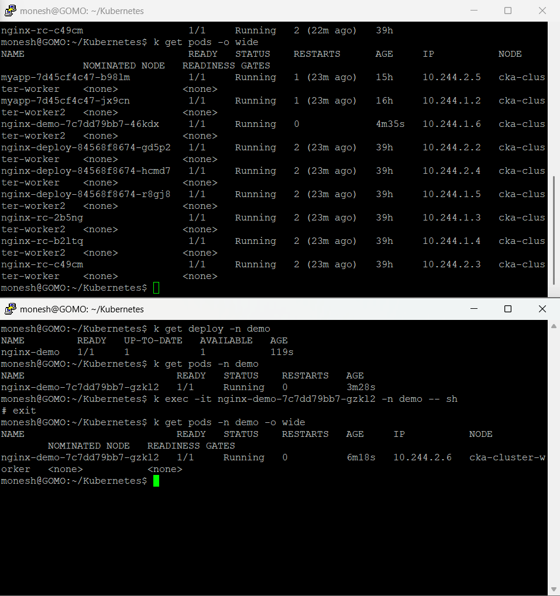


``` bash
monesh@GOMO:~/Kubernetes$  k create deploy nginx-demo --image=nginx
deployment.apps/nginx-demo created
monesh@GOMO:~/Kubernetes$ k get deploy
NAME           READY   UP-TO-DATE   AVAILABLE   AGE
myapp          2/2     2            2           16h
nginx-demo     1/1     1            1           11s
nginx-deploy   3/3     3            3           38h
monesh@GOMO:~/Kubernetes$ k get pods
NAME                            READY   STATUS    RESTARTS      AGE
myapp-7d45cf4c47-b98lm          1/1     Running   1 (21m ago)   15h
myapp-7d45cf4c47-jx9cn          1/1     Running   1 (21m ago)   16h
nginx-demo-7c7dd79bb7-46kdx     1/1     Running   0             3m28s
nginx-deploy-84568f8674-gd5p2   1/1     Running   2 (21m ago)   39h
nginx-deploy-84568f8674-hcmd7   1/1     Running   2 (21m ago)   39h
nginx-deploy-84568f8674-r8gj8   1/1     Running   2 (21m ago)   39h
nginx-rc-2b5ng                  1/1     Running   2 (21m ago)   39h
nginx-rc-b2ltq                  1/1     Running   2 (21m ago)   39h
nginx-rc-c49cm                  1/1     Running   2 (21m ago)   39h
monesh@GOMO:~/Kubernetes$ k exec -it nginx-demo-7c7dd79bb7-46kdx -- sh
# exit
monesh@GOMO:~/Kubernetes$ k get pods
NAME                            READY   STATUS    RESTARTS      AGE
myapp-7d45cf4c47-b98lm          1/1     Running   1 (22m ago)   15h
myapp-7d45cf4c47-jx9cn          1/1     Running   1 (22m ago)   16h
nginx-demo-7c7dd79bb7-46kdx     1/1     Running   0             4m29s
nginx-deploy-84568f8674-gd5p2   1/1     Running   2 (22m ago)   39h
nginx-deploy-84568f8674-hcmd7   1/1     Running   2 (22m ago)   39h
nginx-deploy-84568f8674-r8gj8   1/1     Running   2 (22m ago)   39h
nginx-rc-2b5ng                  1/1     Running   2 (22m ago)   39h
nginx-rc-b2ltq                  1/1     Running   2 (22m ago)   39h
nginx-rc-c49cm                  1/1     Running   2 (22m ago)   39h
monesh@GOMO:~/Kubernetes$ k get pods -o wide
NAME                            READY   STATUS    RESTARTS      AGE     IP           NODE                  NOMINATED NODE   READINESS GATES
myapp-7d45cf4c47-b98lm          1/1     Running   1 (23m ago)   15h     10.244.2.5   cka-cluster-worker    <none>           <none>
myapp-7d45cf4c47-jx9cn          1/1     Running   1 (23m ago)   16h     10.244.1.2   cka-cluster-worker2   <none>           <none>
nginx-demo-7c7dd79bb7-46kdx     1/1     Running   0             4m35s   10.244.1.6   cka-cluster-worker2   <none>           <none>
nginx-deploy-84568f8674-gd5p2   1/1     Running   2 (23m ago)   39h     10.244.2.2   cka-cluster-worker    <none>           <none>
nginx-deploy-84568f8674-hcmd7   1/1     Running   2 (23m ago)   39h     10.244.2.4   cka-cluster-worker    <none>           <none>
nginx-deploy-84568f8674-r8gj8   1/1     Running   2 (23m ago)   39h     10.244.1.5   cka-cluster-worker2   <none>           <none>
nginx-rc-2b5ng                  1/1     Running   2 (23m ago)   39h     10.244.1.3   cka-cluster-worker2   <none>           <none>
nginx-rc-b2ltq                  1/1     Running   2 (23m ago)   39h     10.244.1.4   cka-cluster-worker2   <none>           <none>
nginx-rc-c49cm                  1/1     Running   2 (23m ago)   39h     10.244.2.3   cka-cluster-worker    <none>           <none>
monesh@GOMO:~/Kubernetes$ k exec -it nginx-demo-7c7dd79bb7-46kdx -- sh
# curl 10.244.2.6
<!DOCTYPE html>
<html>
<head>
<title>Welcome to nginx!</title>
<style>
html { color-scheme: light dark; }
body { width: 35em; margin: 0 auto;
font-family: Tahoma, Verdana, Arial, sans-serif; }
</style>
</head>
<body>
<h1>Welcome to nginx!</h1>
<p>If you see this page, the nginx web server is successfully installed and
working. Further configuration is required.</p>

<p>For online documentation and support please refer to
<a href="http://nginx.org/">nginx.org</a>.<br/>
Commercial support is available at
<a href="http://nginx.com/">nginx.com</a>.</p>

<p><em>Thank you for using nginx.</em></p>
</body>
</html>
#
```

- demo

``` bash
monesh@GOMO:~/Kubernetes$ k get deploy -n demo
NAME         READY   UP-TO-DATE   AVAILABLE   AGE
nginx-demo   1/1     1            1           119s
monesh@GOMO:~/Kubernetes$ k get pods -n demo
NAME                          READY   STATUS    RESTARTS   AGE
nginx-demo-7c7dd79bb7-gzkl2   1/1     Running   0          3m28s
monesh@GOMO:~/Kubernetes$ k exec -it nginx-demo-7c7dd79bb7-gzkl2 -n demo -- sh
# exit
monesh@GOMO:~/Kubernetes$ k get pods -n demo -o wide
NAME                          READY   STATUS    RESTARTS   AGE     IP           NODE                 NOMINATED NODE   READINESS GATES
nginx-demo-7c7dd79bb7-gzkl2   1/1     Running   0          6m18s   10.244.2.6   cka-cluster-worker   <none>           <none>
monesh@GOMO:~/Kubernetes$ k exec -it nginx-demo-7c7dd79bb7-gzkl2 -n demo -- sh
# curl 10.244.1.6
<!DOCTYPE html>
<html>
<head>
<title>Welcome to nginx!</title>
<style>
html { color-scheme: light dark; }
body { width: 35em; margin: 0 auto;
font-family: Tahoma, Verdana, Arial, sans-serif; }
</style>
</head>
<body>
<h1>Welcome to nginx!</h1>
<p>If you see this page, the nginx web server is successfully installed and
working. Further configuration is required.</p>

<p>For online documentation and support please refer to
<a href="http://nginx.org/">nginx.org</a>.<br/>
Commercial support is available at
<a href="http://nginx.com/">nginx.com</a>.</p>

<p><em>Thank you for using nginx.</em></p>
</body>
</html>
#
```

- scale the replica 

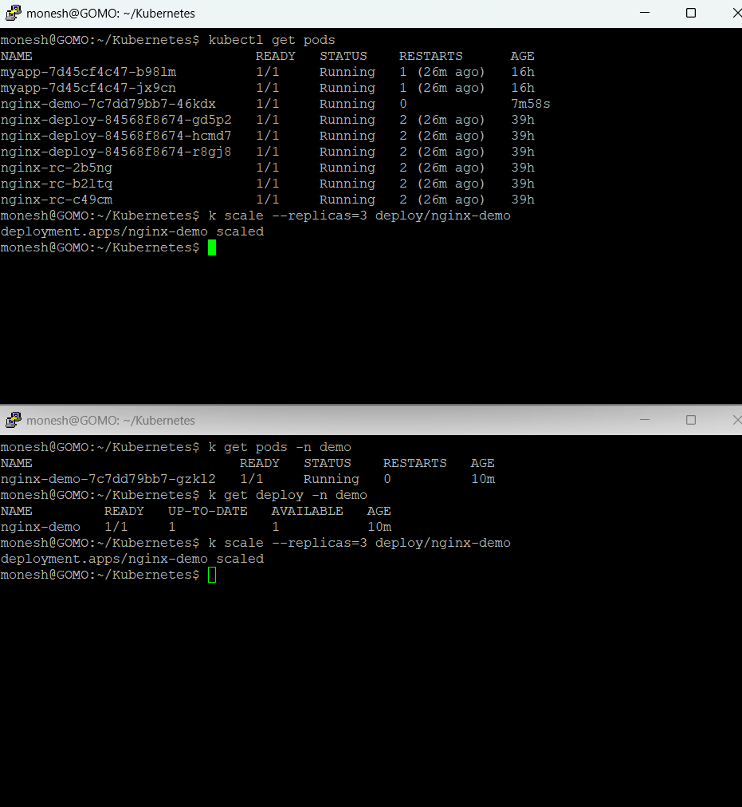

``` bash
monesh@GOMO:~/Kubernetes$ k get pods  -n demo
NAME                          READY   STATUS    RESTARTS   AGE
nginx-demo-7c7dd79bb7-f45xr   1/1     Running   0          8s
nginx-demo-7c7dd79bb7-gzkl2   1/1     Running   0          12m
nginx-demo-7c7dd79bb7-qgqf8   1/1     Running   0          8s
monesh@GOMO:~/Kubernetes$

```

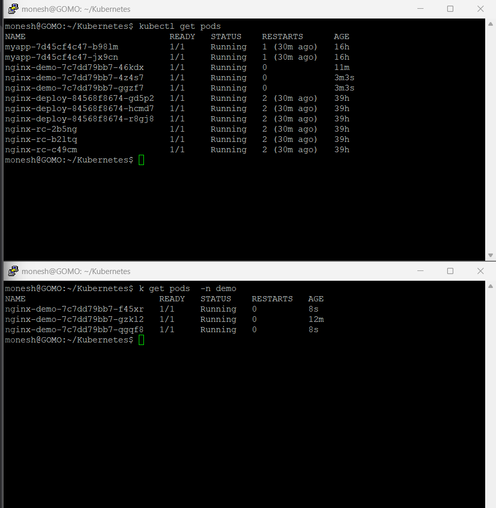

---

## Expose the ```demo-ns``` in imperative mdoe 

``` bash
monesh@GOMO:~/Kubernetes$ k get pods  -n demo
NAME                          READY   STATUS    RESTARTS   AGE
nginx-demo-7c7dd79bb7-f45xr   1/1     Running   0          8s
nginx-demo-7c7dd79bb7-gzkl2   1/1     Running   0          12m
nginx-demo-7c7dd79bb7-qgqf8   1/1     Running   0          8s
monesh@GOMO:~/Kubernetes$ k expose deploy/nginx-demo --name=svc-demo --port 80 -n=demo
service/svc-demo exposed
monesh@GOMO:~/Kubernetes$ k get svc -n demo
NAME       TYPE        CLUSTER-IP     EXTERNAL-IP   PORT(S)   AGE
svc-demo   ClusterIP   10.96.13.148   <none>        80/TCP    48s
monesh@GOMO:~/Kubernetes$


```

<br>

```bash 
monesh@GOMO:~/Kubernetes$ kubectl get pods
NAME                            READY   STATUS    RESTARTS      AGE
myapp-7d45cf4c47-b98lm          1/1     Running   1 (30m ago)   16h
myapp-7d45cf4c47-jx9cn          1/1     Running   1 (30m ago)   16h
nginx-demo-7c7dd79bb7-46kdx     1/1     Running   0             11m
nginx-demo-7c7dd79bb7-4z4s7     1/1     Running   0             3m3s
nginx-demo-7c7dd79bb7-ggzf7     1/1     Running   0             3m3s
nginx-deploy-84568f8674-gd5p2   1/1     Running   2 (30m ago)   39h
nginx-deploy-84568f8674-hcmd7   1/1     Running   2 (30m ago)   39h
nginx-deploy-84568f8674-r8gj8   1/1     Running   2 (30m ago)   39h
nginx-rc-2b5ng                  1/1     Running   2 (30m ago)   39h
nginx-rc-b2ltq                  1/1     Running   2 (30m ago)   39h
nginx-rc-c49cm                  1/1     Running   2 (30m ago)   39h
monesh@GOMO:~/Kubernetes$ k expose deploy/nginx-demo --name=svc-default  --port 80
service/svc-default exposed
monesh@GOMO:~/Kubernetes$ k get svc
NAME                  TYPE           CLUSTER-IP      EXTERNAL-IP   PORT(S)        AGE
cluster-svc           ClusterIP      10.96.72.28     <none>        80/TCP         38h
cluster-svc-task-3    ClusterIP      10.96.232.95    <none>        80/TCP         16h
kubernetes            ClusterIP      10.96.0.1       <none>        443/TCP        39h
lb-svc                LoadBalancer   10.96.109.251   <pending>     80:31275/TCP   38h
nodeport-svc-task-3   NodePort       10.96.130.177   <none>        80:30001/TCP   15h
svc-default           ClusterIP      10.96.234.109   <none>        80/TCP         8s
monesh@GOMO:~/Kubernetes$

```
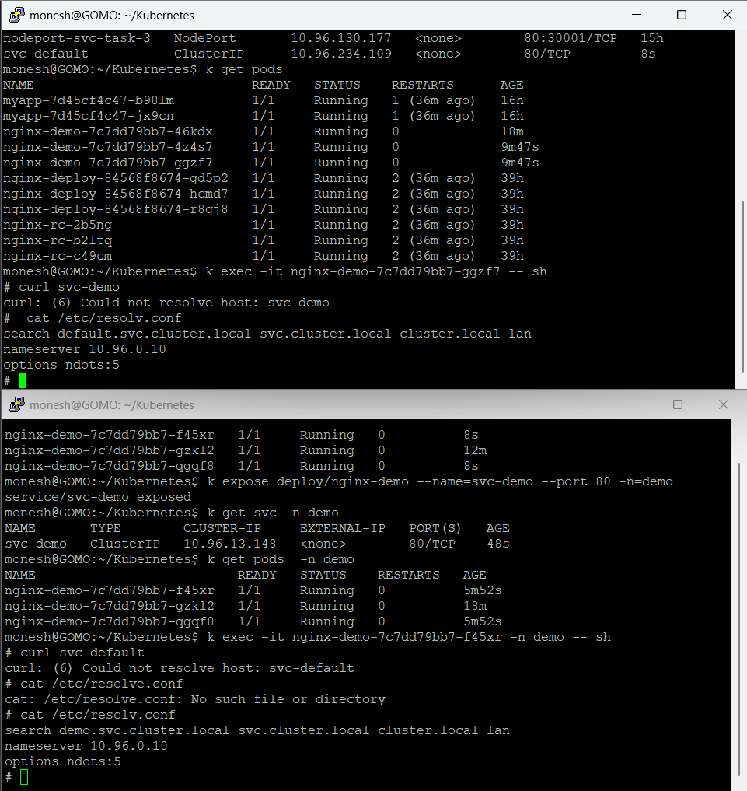


``` bash
monesh@GOMO:~/Kubernetes$ k get pods  -n demo
NAME                          READY   STATUS    RESTARTS   AGE
nginx-demo-7c7dd79bb7-f45xr   1/1     Running   0          8s
nginx-demo-7c7dd79bb7-gzkl2   1/1     Running   0          12m
nginx-demo-7c7dd79bb7-qgqf8   1/1     Running   0          8s
monesh@GOMO:~/Kubernetes$ k expose deploy/nginx-demo --name=svc-demo --port 80 -n=demo
service/svc-demo exposed
monesh@GOMO:~/Kubernetes$ k get svc -n demo
NAME       TYPE        CLUSTER-IP     EXTERNAL-IP   PORT(S)   AGE
svc-demo   ClusterIP   10.96.13.148   <none>        80/TCP    48s
monesh@GOMO:~/Kubernetes$ k get pods  -n demo
NAME                          READY   STATUS    RESTARTS   AGE
nginx-demo-7c7dd79bb7-f45xr   1/1     Running   0          5m52s
nginx-demo-7c7dd79bb7-gzkl2   1/1     Running   0          18m
nginx-demo-7c7dd79bb7-qgqf8   1/1     Running   0          5m52s
monesh@GOMO:~/Kubernetes$ k exec -it nginx-demo-7c7dd79bb7-f45xr -n demo -- sh
# curl svc-default
curl: (6) Could not resolve host: svc-default
# cat /etc/resolve.conf
cat: /etc/resolve.conf: No such file or directory
# cat /etc/resolv.conf
search demo.svc.cluster.local svc.cluster.local cluster.local lan
nameserver 10.96.0.10
options ndots:5
# curl svc-default. default.svc.cluster.local^[[D^[[D^[[D^[[D^[[D^[[D^[[D^[[D^[[D^[[D^[[D^[[D^[[D^[[D^[[D^[[D^[[D^C
# curl svc-default. default.svc.cluster.local
curl: (6) Could not resolve host: svc-default.
curl: (6) Could not resolve host: default.svc.cluster.local
# curl svc-default.default.svc.cluster.local
<!DOCTYPE html>
<html>
<head>
<title>Welcome to nginx!</title>
<style>
html { color-scheme: light dark; }
body { width: 35em; margin: 0 auto;
font-family: Tahoma, Verdana, Arial, sans-serif; }
</style>
</head>
<body>
<h1>Welcome to nginx!</h1>
<p>If you see this page, the nginx web server is successfully installed and
working. Further configuration is required.</p>

<p>For online documentation and support please refer to
<a href="http://nginx.org/">nginx.org</a>.<br/>
Commercial support is available at
<a href="http://nginx.com/">nginx.com</a>.</p>

<p><em>Thank you for using nginx.</em></p>
</body>
</html>
#
```

``` bash
monesh@GOMO:~/Kubernetes$ k expose deploy/nginx-demo --name=svc-default  --port 80
service/svc-default exposed
monesh@GOMO:~/Kubernetes$ k get svc
NAME                  TYPE           CLUSTER-IP      EXTERNAL-IP   PORT(S)        AGE
cluster-svc           ClusterIP      10.96.72.28     <none>        80/TCP         38h
cluster-svc-task-3    ClusterIP      10.96.232.95    <none>        80/TCP         16h
kubernetes            ClusterIP      10.96.0.1       <none>        443/TCP        39h
lb-svc                LoadBalancer   10.96.109.251   <pending>     80:31275/TCP   38h
nodeport-svc-task-3   NodePort       10.96.130.177   <none>        80:30001/TCP   15h
svc-default           ClusterIP      10.96.234.109   <none>        80/TCP         8s
monesh@GOMO:~/Kubernetes$ k get pods
NAME                            READY   STATUS    RESTARTS      AGE
myapp-7d45cf4c47-b98lm          1/1     Running   1 (36m ago)   16h
myapp-7d45cf4c47-jx9cn          1/1     Running   1 (36m ago)   16h
nginx-demo-7c7dd79bb7-46kdx     1/1     Running   0             18m
nginx-demo-7c7dd79bb7-4z4s7     1/1     Running   0             9m47s
nginx-demo-7c7dd79bb7-ggzf7     1/1     Running   0             9m47s
nginx-deploy-84568f8674-gd5p2   1/1     Running   2 (36m ago)   39h
nginx-deploy-84568f8674-hcmd7   1/1     Running   2 (36m ago)   39h
nginx-deploy-84568f8674-r8gj8   1/1     Running   2 (36m ago)   39h
nginx-rc-2b5ng                  1/1     Running   2 (36m ago)   39h
nginx-rc-b2ltq                  1/1     Running   2 (36m ago)   39h
nginx-rc-c49cm                  1/1     Running   2 (36m ago)   39h
monesh@GOMO:~/Kubernetes$ k exec -it nginx-demo-7c7dd79bb7-ggzf7 -- sh
# curl svc-demo
curl: (6) Could not resolve host: svc-demo
#  cat /etc/resolv.conf
search default.svc.cluster.local svc.cluster.local cluster.local lan
nameserver 10.96.0.10
options ndots:5
# curl svc-demo.svc.cluster.local svc.cluster.local cluster.local
curl: (6) Could not resolve host: svc-demo.svc.cluster.local
curl: (6) Could not resolve host: svc.cluster.local
curl: (6) Could not resolve host: cluster.local
# curl svc-demo.demo.svc.cluster.local
<!DOCTYPE html>
<html>
<head>
<title>Welcome to nginx!</title>
<style>
html { color-scheme: light dark; }
body { width: 35em; margin: 0 auto;
font-family: Tahoma, Verdana, Arial, sans-serif; }
</style>
</head>
<body>
<h1>Welcome to nginx!</h1>
<p>If you see this page, the nginx web server is successfully installed and
working. Further configuration is required.</p>

<p>For online documentation and support please refer to
<a href="http://nginx.org/">nginx.org</a>.<br/>
Commercial support is available at
<a href="http://nginx.com/">nginx.com</a>.</p>

<p><em>Thank you for using nginx.</em></p>
</body>
</html>
#
```


- Fully Qualifed Domain name
 
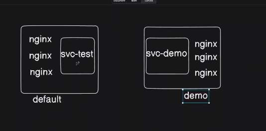

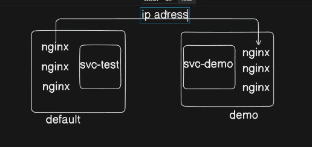

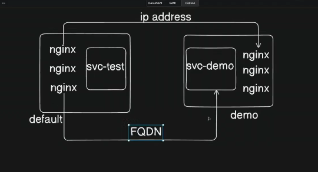

- HOSTNAME : namespace wide

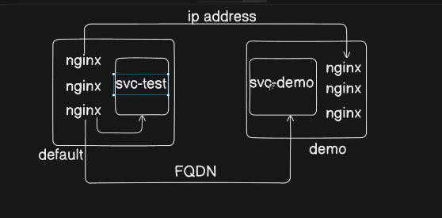
