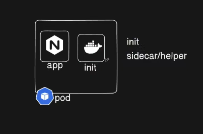
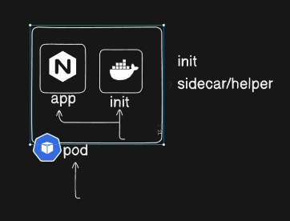

- Init container is the initialization container , run before all containers starts or sidecar container also refered as helper container



- when the request is comes to the pod it first start the init container , the app container starts based on init container 



- Init container share the resources of the pod to all containers

---

``` bash

Pod
├── init-container (prepare-data)
│     └── writes /shared/message.txt
│
├── app-container (flask-app)
│     └── reads /shared/message.txt
│
└── sidecar-container (logger)
      └── tails /shared/message.txt

```

---

``` app.py```

``` py
from flask import Flask
import os

app = Flask(__name__)

@app.route("/")
def home():
    path = "/shared/message.txt"

    if not os.path.exists(path):
        return "Message file not found yet", 503

    with open(path, "r") as f:
        message = f.read()

    return f"Message from init container: {message}"

if __name__ == "__main__":
    app.run(host="0.0.0.0", port=5000)

```

``` Dockerfile

FROM python:3.11-slim

WORKDIR /app

COPY app.py .

RUN pip install flask

CMD ["python", "app.py"]

```

```pod.yml```

---
apiVersion: v1
kind: Pod
metadata:
  name: flask-multi-pod
spec:
  volumes:
    - name: shared-data
      emptyDir: {}

  initContainers:
    - name: prepare-data
      image: busybox
      command:
        - sh
        - -c
        - |
          echo "Hello from Init Container" > /shared/message.txt
      volumeMounts:
        - name: shared-data
          mountPath: /shared

  containers:
    - name: flask-app
      image: moneshgomo/flask-multi:1.0
      ports:
        - containerPort: 5000
      volumeMounts:
        - name: shared-data
          mountPath: /shared

    - name: sidecar-logger
      image: busybox
      command:
        - sh
        - -c
        - |
          while true; do
            echo "Sidecar sees: $(cat /shared/message.txt)"
            sleep 5
          done
      volumeMounts:
        - name: shared-data
          mountPath: /shared

``` yaml


```