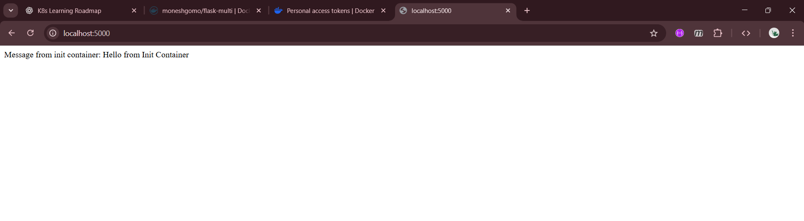

``` bash

monesh@GOMO:~/Kubernetes/multipod$ vim app.py
monesh@GOMO:~/Kubernetes/multipod$ vim Dockerfile
monesh@GOMO:~/Kubernetes/multipod$ docker build -t flask-multi:1.0 .
[+] Building 64.4s (10/10) FINISHED                                                                                                                                           docker:default
 => [internal] load build definition from Dockerfile                                                                                                                                    0.1s
 => => transferring dockerfile: 138B                                                                                                                                                    0.0s
 => [internal] load metadata for docker.io/library/python:3.11-slim                                                                                                                     4.9s
 => [auth] library/python:pull token for registry-1.docker.io                                                                                                                           0.0s
 => [internal] load .dockerignore                                                                                                                                                       0.1s
 => => transferring context: 2B                                                                                                                                                         0.0s
 => [1/4] FROM docker.io/library/python:3.11-slim@sha256:5be45dbade29bebd6886af6b438fd7e0b4eb7b611f39ba62b430263f82de36d2                                                              28.1s
 => => resolve docker.io/library/python:3.11-slim@sha256:5be45dbade29bebd6886af6b438fd7e0b4eb7b611f39ba62b430263f82de36d2                                                               0.1s
 => => sha256:3e731abb5c1dd05aef62585d392d31ad26089dc4c031730e5ab0225aef80b3f2 14.36MB / 14.36MB                                                                                       13.7s
 => => sha256:5be45dbade29bebd6886af6b438fd7e0b4eb7b611f39ba62b430263f82de36d2 10.37kB / 10.37kB                                                                                        0.0s
 => => sha256:89abad2fb0c3633705054018ae09caae4bd0e0febf57fb57a96fd41769c94e12 1.75kB / 1.75kB                                                                                          0.0s
 => => sha256:fa659464a114c340e31c7b7954a1aa679de7e7f5346e4b5804e8422b2596aff9 5.47kB / 5.47kB                                                                                          0.0s
 => => sha256:119d43eec815e5f9a47da3a7d59454581b1e204b0c34db86f171b7ceb3336533 29.77MB / 29.77MB                                                                                       18.7s
 => => sha256:5b09819094bb89d5b2416ff2fb03f68666a5372c358cfd22f2b62d7f6660d906 1.29MB / 1.29MB                                                                                          3.2s
 => => sha256:0b2bf04f68e9f306a8a83f57c6ced322a23968bf3d5acebc07e055c090240826 250B / 250B                                                                                              4.0s
 => => extracting sha256:119d43eec815e5f9a47da3a7d59454581b1e204b0c34db86f171b7ceb3336533                                                                                               4.6s
 => => extracting sha256:5b09819094bb89d5b2416ff2fb03f68666a5372c358cfd22f2b62d7f6660d906                                                                                               0.4s
 => => extracting sha256:3e731abb5c1dd05aef62585d392d31ad26089dc4c031730e5ab0225aef80b3f2                                                                                               3.2s
 => => extracting sha256:0b2bf04f68e9f306a8a83f57c6ced322a23968bf3d5acebc07e055c090240826                                                                                               0.0s
 => [internal] load build context                                                                                                                                                       0.1s
 => => transferring context: 313B                                                                                                                                                       0.0s
 => [2/4] WORKDIR /app                                                                                                                                                                  0.5s
 => [3/4] COPY app.py .                                                                                                                                                                 0.2s
 => [4/4] RUN pip install flask                                                                                                                                                        29.3s
 => exporting to image                                                                                                                                                                  0.5s 
 => => exporting layers                                                                                                                                                                 0.4s 
 => => writing image sha256:6183fc840875a28b1385d06d01bb95be2357680d7b76bce7013bafc2255204fa                                                                                            0.0s 
 => => naming to docker.io/library/flask-multi:1.0                                                                                                                                      0.0s 
monesh@GOMO:~/Kubernetes/multipod$ docker login -u moneshgomo                                                                                                                                
                                                                                                                                                                                             
i Info → A Personal Access Token (PAT) can be used instead.
         To create a PAT, visit https://app.docker.com/settings
         
         
Password: 

WARNING! Your credentials are stored unencrypted in '/home/monesh/.docker/config.json'.
Configure a credential helper to remove this warning. See
https://docs.docker.com/go/credential-store/

Login Succeeded
monesh@GOMO:~/Kubernetes/multipod$ docker tag flask-multi:1.0 moneshgomo/flask-multi:1.0
monesh@GOMO:~/Kubernetes/multipod$ docker images
REPOSITORY                       TAG       IMAGE ID       CREATED         SIZE
flask-multi                      1.0       6183fc840875   2 minutes ago   141MB
moneshgomo/flask-multi           1.0       6183fc840875   2 minutes ago   141MB
moneshgomo/calculator-frontend   v1        b7587f6a0a5c   2 weeks ago     53.8MB
calculator-server                latest    2e59815ae29b   3 weeks ago     235MB
calculator-ui                    latest    ff9a0b0b115f   3 weeks ago     53.8MB
frontend-app                     1.0       fc74bb757d0a   3 weeks ago     53.7MB
flask-backend                    1.0       43dac91623c0   3 weeks ago     141MB
localstack/localstack            latest    1c1e2ca53b5e   3 weeks ago     1.14GB
demo-flask                       latest    7e23d359f38f   7 weeks ago     132MB
my-docker-image                  1.0       229313c21d97   3 months ago    192MB
moneshgomodev/client-side-app    1.0       229313c21d97   3 months ago    192MB
ubuntu                           22.04     9fa3e2b5204f   3 months ago    77.9MB
kindest/node                     <none>    4357c93ef232   5 months ago    985MB
nginx                            stable    bf0a563e3e6a   5 months ago    192MB
kindest/node                     <none>    89e7dc9f9131   2 years ago     932MB
openjdk                          17        5e28ba2b4cdb   3 years ago     471MB
monesh@GOMO:~/Kubernetes/multipod$ docker push moneshgomo/flask-multi:1.0
The push refers to repository [docker.io/moneshgomo/flask-multi]
3e4be2b4539d: Pushed 
cef1d1f54f67: Pushed 
723932172ea0: Pushed 
49d74831a287: Mounted from library/python 
5d89b1d5fc98: Mounted from library/python 
523062ea36b5: Mounted from library/python 
e50a58335e13: Mounted from library/python 
1.0: digest: sha256:5af1baf876f455a68c84a2c53f2ff08e2945a4239b83a41a564d0430cec802fc size: 1783
monesh@GOMO:~/Kubernetes/multipod$ cat Dockerfile
FROM python:3.11-slim

WORKDIR /app

COPY app.py .

RUN pip install flask

CMD ["python", "app.py"]

monesh@GOMO:~/Kubernetes/multipod$ rm pod.yaml
monesh@GOMO:~/Kubernetes/multipod$ vim flask-multi-pod.yaml
monesh@GOMO:~/Kubernetes/multipod$ kubectl apply -f multi-container-pod.yaml
error: the path "multi-container-pod.yaml" does not exist
monesh@GOMO:~/Kubernetes/multipod$ kubectl apply -f flask-multi-pod.yaml
pod/flask-multi-pod created
monesh@GOMO:~/Kubernetes/multipod$ kubectl get pod flask-multi-pod
NAME              READY   STATUS            RESTARTS   AGE
flask-multi-pod   0/2     PodInitializing   0          50s
monesh@GOMO:~/Kubernetes/multipod$ kubectl get pod flask-multi-pod
NAME              READY   STATUS   RESTARTS   AGE
flask-multi-pod   1/2     Error    0          60s
monesh@GOMO:~/Kubernetes/multipod$ ^C
monesh@GOMO:~/Kubernetes/multipod$ kubectl describe pod flask-multi-pod
Name:             flask-multi-pod
Namespace:        default
Priority:         0
Service Account:  default
Node:             gomo-cluster-worker/172.18.0.2
Start Time:       Mon, 26 Jan 2026 16:52:31 +0530
Labels:           <none>
Annotations:      <none>
Status:           Running
IP:               10.244.1.3
IPs:
  IP:  10.244.1.3
Init Containers:
  prepare-data:
    Container ID:  containerd://fc2f0af0111a49c2b663b5c81818f1b75afb2adf229dd7fc8485a89c977f7b79
    Image:         busybox
    Image ID:      docker.io/library/busybox@sha256:e226d6308690dbe282443c8c7e57365c96b5228f0fe7f40731b5d84d37a06839
    Port:          <none>
    Host Port:     <none>
    Command:
      sh
      -c
      echo "Hello from Init Container" > /shared/message.txt
      
    State:          Terminated
      Reason:       Completed
      Exit Code:    0
      Started:      Mon, 26 Jan 2026 16:52:50 +0530
      Finished:     Mon, 26 Jan 2026 16:52:50 +0530
    Ready:          True
    Restart Count:  0
    Environment:    <none>
    Mounts:
      /shared from shared-data (rw)
      /var/run/secrets/kubernetes.io/serviceaccount from kube-api-access-f99jg (ro)
Containers:
  flask-app:
    Container ID:   containerd://14ead008816ea79b110c61c6a6b00648a928142d9109799fb10da1060b737221
    Image:          moneshgomo/flask-multi:1.0
    Image ID:       docker.io/moneshgomo/flask-multi@sha256:5af1baf876f455a68c84a2c53f2ff08e2945a4239b83a41a564d0430cec802fc
    Port:           5000/TCP
    Host Port:      0/TCP
    State:          Terminated
      Reason:       Error
      Exit Code:    1
      Started:      Mon, 26 Jan 2026 16:53:44 +0530
      Finished:     Mon, 26 Jan 2026 16:53:44 +0530
    Last State:     Terminated
      Reason:       Error
      Exit Code:    1
      Started:      Mon, 26 Jan 2026 16:53:30 +0530
      Finished:     Mon, 26 Jan 2026 16:53:30 +0530
    Ready:          False
    Restart Count:  2
    Environment:    <none>
    Mounts:
      /shared from shared-data (rw)
      /var/run/secrets/kubernetes.io/serviceaccount from kube-api-access-f99jg (ro)
  sidecar-logger:
    Container ID:  containerd://2ea1c1a54b7ac68e4d4f6f3ec16486dfcfb54c9fdf096605af6f72fc2d04f4a8
    Image:         busybox
    Image ID:      docker.io/library/busybox@sha256:e226d6308690dbe282443c8c7e57365c96b5228f0fe7f40731b5d84d37a06839
    Port:          <none>
    Host Port:     <none>
    Command:
      sh
      -c
      while true; do
        echo "Sidecar sees: $(cat /shared/message.txt)"
        sleep 5
      done
      
    State:          Running
      Started:      Mon, 26 Jan 2026 16:53:29 +0530
    Ready:          True
    Restart Count:  0
    Environment:    <none>
    Mounts:
      /shared from shared-data (rw)
      /var/run/secrets/kubernetes.io/serviceaccount from kube-api-access-f99jg (ro)
Conditions:
  Type              Status
  Initialized       True 
  Ready             False 
  ContainersReady   False 
  PodScheduled      True 
Volumes:
  shared-data:
    Type:       EmptyDir (a temporary directory that shares a pod's lifetime)
    Medium:     
    SizeLimit:  <unset>
  kube-api-access-f99jg:
    Type:                    Projected (a volume that contains injected data from multiple sources)
    TokenExpirationSeconds:  3607
    ConfigMapName:           kube-root-ca.crt
    Optional:                false
    DownwardAPI:             true
QoS Class:                   BestEffort
Node-Selectors:              <none>
Tolerations:                 node.kubernetes.io/not-ready:NoExecute op=Exists for 300s
                             node.kubernetes.io/unreachable:NoExecute op=Exists for 300s
Events:
  Type     Reason     Age               From               Message
  ----     ------     ----              ----               -------
  Normal   Scheduled  82s               default-scheduler  Successfully assigned default/flask-multi-pod to gomo-cluster-worker
  Normal   Pulling    81s               kubelet            Pulling image "busybox"
  Normal   Pulled     63s               kubelet            Successfully pulled image "busybox" in 17.927298061s (17.927394406s including waiting)
  Normal   Created    63s               kubelet            Created container prepare-data
  Normal   Started    63s               kubelet            Started container prepare-data
  Normal   Pulling    62s               kubelet            Pulling image "moneshgomo/flask-multi:1.0"
  Normal   Pulled     27s               kubelet            Successfully pulled image "moneshgomo/flask-multi:1.0" in 34.254944529s (34.255009005s including waiting)
  Normal   Pulling    27s               kubelet            Pulling image "busybox"
  Normal   Pulled     24s               kubelet            Successfully pulled image "busybox" in 2.985584883s (2.985624756s including waiting)
  Normal   Created    24s               kubelet            Created container sidecar-logger
  Normal   Started    24s               kubelet            Started container sidecar-logger
  Normal   Created    9s (x3 over 27s)  kubelet            Created container flask-app
  Normal   Started    9s (x3 over 27s)  kubelet            Started container flask-app
  Normal   Pulled     9s (x2 over 23s)  kubelet            Container image "moneshgomo/flask-multi:1.0" already present on machine
  Warning  BackOff    8s (x3 over 22s)  kubelet            Back-off restarting failed container flask-app in pod flask-multi-pod_default(ac7be4c8-1f6d-4b36-a89b-7641de8000b2)
monesh@GOMO:~/Kubernetes/multipod$ rm app.py
monesh@GOMO:~/Kubernetes/multipod$ vim app.py
monesh@GOMO:~/Kubernetes/multipod$ docker build -t moneshgomo/flask-multi:2.0 . 
[+] Building 15.8s (10/10) FINISHED                                                                                                                                           docker:default
 => [internal] load build definition from Dockerfile                                                                                                                                    0.2s
 => => transferring dockerfile: 138B                                                                                                                                                    0.1s
 => [internal] load metadata for docker.io/library/python:3.11-slim                                                                                                                     2.6s
 => [auth] library/python:pull token for registry-1.docker.io                                                                                                                           0.0s
 => [internal] load .dockerignore                                                                                                                                                       0.0s
 => => transferring context: 2B                                                                                                                                                         0.0s
 => [1/4] FROM docker.io/library/python:3.11-slim@sha256:5be45dbade29bebd6886af6b438fd7e0b4eb7b611f39ba62b430263f82de36d2                                                               0.0s
 => [internal] load build context                                                                                                                                                       0.1s
 => => transferring context: 418B                                                                                                                                                       0.0s
 => CACHED [2/4] WORKDIR /app                                                                                                                                                           0.0s
 => [3/4] COPY app.py .                                                                                                                                                                 0.1s
 => [4/4] RUN pip install flask                                                                                                                                                        11.5s
 => exporting to image                                                                                                                                                                  0.7s 
 => => exporting layers                                                                                                                                                                 0.5s 
 => => writing image sha256:b726da41a1aa15cc1e0b280b99c44bd490fc3bd56195611b08c9cfc37b8f7885                                                                                            0.0s 
 => => naming to docker.io/moneshgomo/flask-multi:2.0                                                                                                                                   0.0s 
monesh@GOMO:~/Kubernetes/multipod$ docker push moneshgomo/flask-multi:2.0                                                                                                                    
The push refers to repository [docker.io/moneshgomo/flask-multi]                                                                                                                             
1b8da630304a: Pushed 
35494781097d: Pushed 
723932172ea0: Layer already exists 
49d74831a287: Layer already exists 
5d89b1d5fc98: Layer already exists 
523062ea36b5: Layer already exists 
e50a58335e13: Layer already exists 
2.0: digest: sha256:90a28929206c3ebae9426df2ef87ed8307bf54f45b413575053210e73e25cd83 size: 1783
monesh@GOMO:~/Kubernetes/multipod$ ls
Dockerfile  app.py  flask-multi-pod.yaml
monesh@GOMO:~/Kubernetes/multipod$ rm flask-multi-pod.yaml
monesh@GOMO:~/Kubernetes/multipod$ vim flask-multi-pod.yaml
monesh@GOMO:~/Kubernetes/multipod$ kubectl delete pod flask-multi-pod
pod "flask-multi-pod" deleted from default namespace

monesh@GOMO:~/Kubernetes/multipod$ kubectl apply -f flask-multi-pod.yaml
pod/flask-multi-pod created
monesh@GOMO:~/Kubernetes/multipod$ kubectl get pod flask-multi-pod
NAME              READY   STATUS            RESTARTS   AGE
flask-multi-pod   0/2     PodInitializing   0          16s
monesh@GOMO:~/Kubernetes/multipod$ kubectl get pod flask-multi-pod
NAME              READY   STATUS            RESTARTS   AGE
flask-multi-pod   0/2     PodInitializing   0          23s
monesh@GOMO:~/Kubernetes/multipod$ kubectl get pod flask-multi-pod
NAME              READY   STATUS    RESTARTS   AGE
flask-multi-pod   2/2     Running   0          28s
monesh@GOMO:~/Kubernetes/multipod$ kubectl logs flask-multi-pod -c sidecar-logger
Sidecar sees: Hello from Init Container
Sidecar sees: Hello from Init Container
Sidecar sees: Hello from Init Container
Sidecar sees: Hello from Init Container
Sidecar sees: Hello from Init Container
Sidecar sees: Hello from Init Container
Sidecar sees: Hello from Init Container
Sidecar sees: Hello from Init Container
Sidecar sees: Hello from Init Container
Sidecar sees: Hello from Init Container
Sidecar sees: Hello from Init Container
monesh@GOMO:~/Kubernetes/multipod$ kubectl port-forward flask-multi-pod 5000:5000
Forwarding from 127.0.0.1:5000 -> 5000
Forwarding from [::1]:5000 -> 5000
Handling connection for 5000
Handling connection for 5000
Handling connection for 5000
Handling connection for 5000

```

